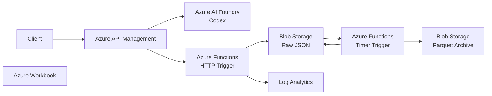

# Azure OpenAI 利用監査ログ基盤

## 目的

Azure API Management(APIM)経由でAzure AI FoundryのLLMを利用する際の監査ログを取得し、利用状況の可視化および長期証跡保管を実現する。

Event Hubsを利用する一般的な構成ではなく、Azure Functionsを利用することで構成を簡素化し、運用コストを削減する。

---

## システム構成

---

## コンポーネント一覧

|サービス|用途|
|---------|----|
|Azure API Management|認証・利用者識別・監査情報取得|
|Azure AI Foundry|LLM実行|
|Azure Functions (HTTP)|監査ログ受信|
|Azure Functions (Timer)|JSON→Parquet変換|
|Blob Storage|JSON一時保存・Archive保管|
|Log Analytics|検索・可視化|
|Azure Workbook|利用分析ダッシュボード|

---

## ドキュメント

- [仕様書](./docs/spec/spec.md)
- [構成図](./docs/spec/diagram.md)
