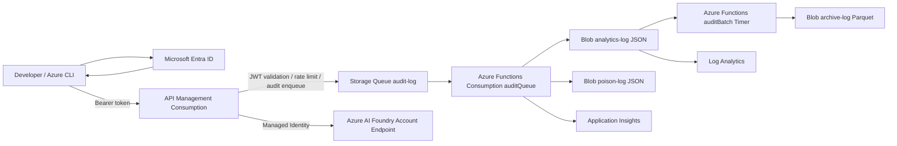

# Azure AI Foundry Codex 社内 AI コーディングエージェント基盤

## 目的

Azure API Management (APIM) を唯一の公開エンドポイントとして、Azure AI Foundry Account Endpoint 上の Codex 利用を認証・認可・監査・コスト分析できるようにする社内向け基盤です。IaC は Bicep のみを使用し、API Key や Project Endpoint / Azure OpenAI Endpoint には依存しません。

## システム構成



## 主要なセキュリティ方針

- クライアントは `az account get-access-token` で取得した Entra ID Bearer Token を APIM に送信します。
- APIM は JWT 検証、OID 許可、IP 制限、レート制限、Correlation ID 生成を実施します。
- Foundry 呼び出しは APIM の User Assigned Managed Identity で行い、クライアント Token は転送しません。
- Storage は Shared Key / Public Blob Access を無効化し、Queue と Blob へのアクセスは RBAC + Managed Identity に限定します。
- 監査ログは本文・プロンプト・Completion・Tool Arguments・ソースコードを保存しません。

## ログフロー

1. APIM がレスポンスの usage メタデータと JWT Claim / HTTP メタデータだけを抽出します。
2. APIM が Storage Queue `audit-log` に非同期で投入します。メッセージ TTL は 1 時間です。
3. Queue Trigger Function `auditQueue` が `analytics-log` に JSON を保存します。
4. 失敗時は `poison-log` にエラー情報と元メッセージを保存します。
5. Timer Trigger Function `auditBatch` が Analytics JSON を Parquet に変換し、`archive-log` に保存します。
6. Lifecycle Policy により Analytics は 90 日、Poison は 14 日、Archive は 730 日で削除されます。

## リポジトリ構成

```text
infra/
  main.bicep
  module/
  parameters/
  policies/apim-policy.xml
  apim/
  functions/
log-batch/
  src/functions/auditQueue.ts
  src/functions/timerTrigger.ts
```

## デプロイ手順

```bash
az login
az account set --subscription <subscription-id>
az bicep build --file infra/main.bicep
az deployment sub create \
  --location japaneast \
  --template-file infra/main.bicep \
  --parameters infra/parameters/dev.bicepparam
```

> Function App への TypeScript パッケージ配置は CI/CD 対象外のため、`log-batch` をビルドして ZIP デプロイしてください。

## 運用クエリ例

```kusto
StorageBlobLogs
| where Uri has "analytics-log"
| summarize count() by bin(TimeGenerated, 1h)
```

## ドキュメント

- [仕様書](./docs/spec/spec.md)
- [構成図](./docs/spec/diagram.md)
