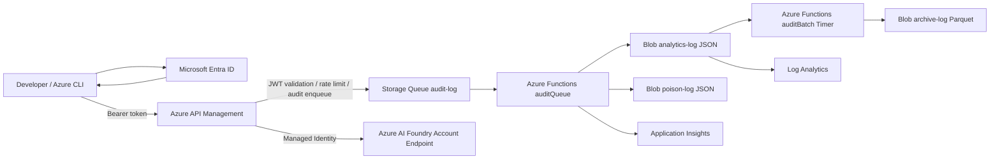

# Azure Infrastructure Build Specification

## AI Coding Agent Platform on Azure AI Foundry (Codex)

Version: 1.0

## 1. Objective

Azure AI Foundry 上の Codex を利用する社内向け AI コーディングエージェント基盤を構築します。Azure API Management (APIM) を唯一の公開エンドポイントとし、認証・認可・監査ログ・コスト分析・アクセス制御を提供します。Infrastructure as Code は Bicep を使用し、Azure リソースはコードで管理します。

## 2. Scope

対象:
- Azure Infrastructure
- Bicep
- Azure API Management
- APIM Policy
- Azure Functions
- Azure Storage
- Azure AI Foundry
- Monitoring
- Logging
- RBAC
- Diagnostic Settings

対象外:
- クライアントアプリケーション
- CI/CD
- アプリケーションロジック

## 3. Design Principles

優先順位:
1. Security
2. Cost Optimization
3. Maintainability
4. Observability
5. Availability

少人数利用を前提とし、低コストかつ運用負荷の低い構成を採用します。

## 4. Constraints

- Subscription Owner 権限を前提とし、Tenant / Global 管理者権限は使用しません。
- IaC は Bicep / AVM のみとし、Terraform / ARM / Portal 前提の構築は行いません。
- Codex は Azure AI Foundry Account Endpoint を利用し、Project Endpoint / Azure OpenAI Endpoint / API Key 認証は使用しません。

## 5. Architecture Summary



## 6. Implementation Notes

- APIM では JWT 検証、Claim 抽出、OID/tenant ID 取得、Correlation ID 生成、Storage Queue への監査ログ送信、Managed Identity による Foundry 呼び出しを実施します。
- Azure Functions は TypeScript / Node.js LTS で実装し、Queue Trigger / Timer Trigger / Poison Handler を提供します。
- Storage は Shared Key / Public Blob Access / SAS を無効化し、RBAC と Managed Identity でのみアクセス可能にします。
- 監査ログは本文・プロンプト・Completion・Tool Arguments・Source Code を保存しません。

## 7. Repository Layout

```text
infra/
  main.bicep
  module/
  parameters/
  policies/apim-policy.xml
  apim/
  functions/
log-http/
log-batch/
```

## 8. Deployment

```bash
az login
az account set --subscription <subscription-id>
az bicep build --file infra/main.bicep
az deployment sub create \
  --location japaneast \
  --template-file infra/main.bicep \
  --parameters infra/parameters/dev.bicepparam
```

## 9. Documentation

- [Specification](./docs/spec/spec.md)
- [Architecture Diagram](./docs/spec/diagram.md)
