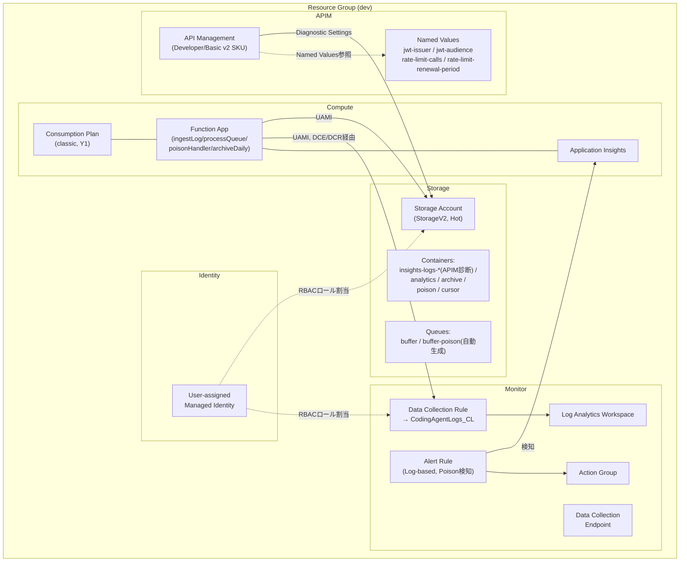

# Bicep IaC 仕様書

## APIM - Azure AI Foundry 通信ログ収集パイプライン（インフラ構成）

> **Version:** 1.0
> **Status:** Draft（実装着手可能レベル）
> **対象IaCツール:** Bicep（`az deployment group create` によるResource Group単位デプロイ）
> **関連仕様書:** Function実装（ingestLog / processQueue / poisonHandler / archiveDaily）は `Azure Functions 仕様書.md`（本紙の親仕様書、v2.3）を参照。本書はインフラ（APIM / Storage / Log Analytics DCR・DCE / RBAC割り当て / Alert Rule等）に専念する。

---

# 1. 改訂履歴

| 版 | 日付 | 内容 |
| --- | --- | --- |
| 1.0 | 2026-07-13 | 初版。Azure Functions仕様書v2.3を前提としたインフラ設計を反映 |

---

# 2. 目的・スコープ

本書は、Azure Functions仕様書（v2.3）が前提とするAzureリソース群を、Bicepにより宣言的・再現可能な形でプロビジョニングするための設計を定義する。

**スコープに含むもの**
* Resource Group内の全Azureリソース定義（APIM / Storage / Function App / UAMI / Log Analytics / DCE・DCR / Application Insights / Alert Rule）
* RBACロール割り当て
* APIM Diagnostic Settings、Named Values、Policy XMLの注入
* dev単一環境向けпаラメータ管理（`.bicepparam`）

**スコープに含まないもの（Function仕様書側）**
* Function App内のアプリケーションロジック（TypeScriptコード）
* Function単位のリトライ・カーソル管理・LogRecordスキーマ

---

# 3. 全体アーキテクチャ



---

# 4. 命名規則

`dev` 単一環境を前提に、以下の命名規則を採用する（Storage Accountのみ英数字24文字以下・記号不可の制約に注意）。

| リソース種別 | 命名パターン | 例（`{proj}=capim`, `{env}=dev` の場合） |
| --- | --- | --- |
| Resource Group | `rg-{proj}-{env}` | `rg-capim-dev` |
| Storage Account | `st{proj}{env}{uniqueSuffix}`（記号なし、24文字以内） | `stcapimdevx7k2p` |
| User-assigned Managed Identity | `id-{proj}-{env}` | `id-capim-dev` |
| Function App / App Service Plan | `func-{proj}-{env}` / `plan-{proj}-{env}` | `func-capim-dev` |
| API Management | `apim-{proj}-{env}` | `apim-capim-dev` |
| Log Analytics Workspace | `log-{proj}-{env}` | `log-capim-dev` |
| Data Collection Endpoint | `dce-{proj}-{env}` | `dce-capim-dev` |
| Data Collection Rule | `dcr-{proj}-{env}` | `dcr-capim-dev` |
| Application Insights | `appi-{proj}-{env}` | `appi-capim-dev` |
| Action Group | `ag-{proj}-{env}-poison` | `ag-capim-dev-poison` |
| Alert Rule | `alert-{proj}-{env}-poison` | `alert-capim-dev-poison` |

`uniqueSuffix` は `uniqueString(resourceGroup().id)` の先頭6〜8文字を使用し、グローバル一意制約（Storage Account名）を満たす。

---

# 5. Bicepモジュール構成

単一 `main.bicep` からモジュールを呼び出す構成とする（Resource Group単位デプロイ、`targetScope = 'resourceGroup'`）。

```
infra/
├── main.bicep                  # エントリポイント、モジュール呼び出しとRBAC割り当てを集約
├── main.dev.bicepparam          # dev環境パラメータ
├── modules/
│   ├── identity.bicep           # UAMI
│   ├── storage.bicep            # Storage Account / Container / Queue
│   ├── loganalytics.bicep       # LAW / DCE / DCR / Custom Table
│   ├── appinsights.bicep        # Application Insights
│   ├── functionapp.bicep        # Consumption Plan + Function App
│   ├── apim.bicep                # APIM本体 + Named Values
│   ├── apim-diagnostics.bicep   # APIM Diagnostic Settings → Storage
│   ├── rbac.bicep                # ロール割り当て（UAMIへの各種Contributor/Sender）
│   └── monitoring-alert.bicep   # Action Group + Log-based Alert Rule
└── policies/
    └── apim-global-policy.xml   # JWT検証・レート制限・ShareId生成のPolicy XML（別ファイル管理）
```

**設計方針**: Policy XMLは巨大化・可読性低下を避けるため、Bicep内文字列埋め込みではなく別ファイル管理とし、`loadTextContent()` で読み込む。Named Values（`{{jwt-issuer}}` 等）はPolicy XML内でプレースホルダー参照させ、値そのものはBicepパラメータから注入する。

---

# 6. Resource Group

dev単一環境のため、Resource Groupは1つ（`rg-capim-dev`）。Subscription-scopeデプロイでRGごと作成することも可能だが、本書では**既存RGへのデプロイ**（`targetScope = 'resourceGroup'`）を前提とし、RG自体の作成はデプロイ実行者の前提条件とする（将来的にstg/prod追加時はSubscription-scopeへ拡張を検討、30章参照）。

---

# 7. Storage Account設計

## 7.1 基本仕様

| 項目 | 値 |
| --- | --- |
| Kind | `StorageV2` |
| SKU | `Standard_LRS`（社内50名未満、devのためLRSで十分。冗長性要件が上がった場合はGRSへ変更検討） |
| アクセス層 | Hot（既定） |
| 階層 | Blob（Hot/Archive Tier混在）+ Queue |
| ネットワーク | Public エンドポイント（23章方針に準拠、Private Endpoint化は将来検討） |
| Shared Key | **無効化**（`allowSharedKeyAccess: false`）。UAMI + RBACのみで運用するため |
| TLS | `minimumTlsVersion: 'TLS1_2'` |
| 階層変更 | Archive Tierへの遷移はFunction実行時（低レベルAPI）で明示指定するため、Lifecycle Managementルールでの自動階層変更は行わない（誤ってAnalytics/cursor等をArchive化しないため） |

## 7.2 Blob Container

| コンテナ名 | 用途 | パブリックアクセス |
| --- | --- | --- |
| `insights-logs-{category}`（APIM Diagnostic Settings既定命名） | APIM診断ログ出力先（Append Blob、PT1H.json） | なし |
| `analytics` | Analytics JSON保存（16章） | なし |
| `archive` | Archive Parquet保存（17章） | なし |
| `poison` | Poison Blob保存（15章） | なし |
| `cursor` | ingestLogカーソル状態保存（11章） | なし |

**注記**: APIM Diagnostic Settingsが出力するコンテナ名（`insights-logs-*`）はAzure Monitor側の規約で自動生成されるため、Bicep側で事前作成は不要（Diagnostic Settings適用時に自動生成される）。ただし、`DIAGNOSTIC_LOG_CONTAINER` アプリケーション設定に実際のコンテナ名を反映させるため、Diagnostic Settings定義側でカテゴリ名を固定し、出力先を予測可能にする（8.2節参照）。

## 7.3 Storage Queue

| Queue名 | 作成方法 |
| --- | --- |
| `buffer` | Bicepで明示作成 |
| `buffer-poison` | **Bicepで作成しない**（Azure Functionsランタイムが初回Poison発生時に自動生成するため。Function仕様書12章の方針と整合） |

## 7.4 Lifecycle Management（リテンション）

Function仕様書27章のリテンション方針をStorage Lifecycle Management Policyとして実装する。

| コンテナ | ルール | 保持 |
| --- | --- | --- |
| `analytics` | `daysAfterModificationGreaterThan: 90` → Delete | 90日 |
| `poison` | `daysAfterModificationGreaterThan: 14` → Delete | 14日 |
| `archive` | `daysAfterModificationGreaterThan: 730` → Delete | 730日（Archive Tierは早期削除料金の対象期間(180日)を大きく超えるため問題なし） |
| `cursor` | ルールなし（永続保持、Function仕様書27章の方針） |
| `insights-logs-*` | ルールなし（APIM Diagnostic Settings側の設定に委ねる。将来検討事項として30章参照） |

**重要**: `archive` コンテナ配下のBlobは既に個別に`tier: Archive`が指定されてアップロードされるため、Lifecycle Management側で階層変更ルール（tierToArchive等）は設定しない。削除ルールのみを設定する。

## 7.5 Bicepスニペット例（storage.bicep 抜粋）

```bicep
resource storageAccount 'Microsoft.Storage/storageAccounts@2023-05-01' = {
  name: storageAccountName
  location: location
  kind: 'StorageV2'
  sku: { name: 'Standard_LRS' }
  properties: {
    minimumTlsVersion: 'TLS1_2'
    allowSharedKeyAccess: false
    allowBlobPublicAccess: false
    networkAcls: {
      defaultAction: 'Allow' // 23章方針: Public、将来Private Endpoint化検討
    }
  }
}

resource blobService 'Microsoft.Storage/storageAccounts/blobServices@2023-05-01' = {
  parent: storageAccount
  name: 'default'
}

var analyticsAndPoisonContainers = ['analytics', 'poison', 'cursor']
resource containers 'Microsoft.Storage/storageAccounts/blobServices/containers@2023-05-01' = [for name in analyticsAndPoisonContainers: {
  parent: blobService
  name: name
  properties: { publicAccess: 'None' }
}]

resource archiveContainer 'Microsoft.Storage/storageAccounts/blobServices/containers@2023-05-01' = {
  parent: blobService
  name: 'archive'
  properties: { publicAccess: 'None' }
}

resource queueService 'Microsoft.Storage/storageAccounts/queueServices@2023-05-01' = {
  parent: storageAccount
  name: 'default'
}

resource bufferQueue 'Microsoft.Storage/storageAccounts/queueServices/queues@2023-05-01' = {
  parent: queueService
  name: 'buffer'
}
// buffer-poison は意図的に作成しない（ランタイムが自動生成）

resource lifecyclePolicy 'Microsoft.Storage/storageAccounts/managementPolicies@2023-05-01' = {
  parent: storageAccount
  name: 'default'
  properties: {
    policy: {
      rules: [
        {
          name: 'analytics-retention-90d'
          type: 'Lifecycle'
          definition: {
            filters: { blobTypes: ['blockBlob'], prefixMatch: ['analytics/'] }
            actions: { baseBlob: { delete: { daysAfterModificationGreaterThan: 90 } } }
          }
        }
        {
          name: 'poison-retention-14d'
          type: 'Lifecycle'
          definition: {
            filters: { blobTypes: ['blockBlob'], prefixMatch: ['poison/'] }
            actions: { baseBlob: { delete: { daysAfterModificationGreaterThan: 14 } } }
          }
        }
        {
          name: 'archive-retention-730d'
          type: 'Lifecycle'
          definition: {
            filters: { blobTypes: ['blockBlob'], prefixMatch: ['archive/'] }
            actions: { baseBlob: { delete: { daysAfterModificationGreaterThan: 730 } } }
          }
        }
      ]
    }
  }
}
```

---

# 8. User-assigned Managed Identity

Function App、APIM（Log Analytics送信は行わないためAPIM自体のUAMI付与は不要だが、将来のバックエンド認証拡張に備え検討）の両方から参照される単一UAMIを作成する。

```bicep
resource uami 'Microsoft.ManagedIdentity/userAssignedIdentities@2023-01-31' = {
  name: uamiName
  location: location
}

output uamiId string = uami.id
output uamiPrincipalId string = uami.properties.principalId
output uamiClientId string = uami.properties.clientId
```

`uamiClientId` はFunction Appアプリケーション設定 `AZURE_CLIENT_ID` へそのまま渡す（Function仕様書25章）。

---

# 9. RBACロール割り当て

Function仕様書22章の必要RBACを、UAMIのPrincipal IDに対して各リソーススコープで割り当てる。

| ロール | ロールID | スコープ | 対象操作 |
| --- | --- | --- | --- |
| Storage Blob Data Contributor | `ba92f5b4-2d11-453d-a403-e96b0029c9fe` | Storage Account | analytics/archive/poison/cursor/insights-logs-* への読み書き |
| Storage Queue Data Contributor | `974c5e8b-45b9-4653-ba55-5f855dd0fb88` | Storage Account | buffer / buffer-poison への読み書き |
| Monitoring Metrics Publisher | `3913510d-42f4-4e42-8a64-420c390055eb` | Log Analytics Workspace | （Functions診断/メトリクス送信用） |
| Data Collection Rule Data Sender... **正式名称は「Monitoring Metrics Publisher」ロールがDCR経由送信にも使用される** | 上記と同一ロールを **DCR** スコープに割当 | DCR | Logs Ingestion API経由でのCodingAgentLogs_CL書き込み |

**注記（Event Hubs Data Receiver）**: Function仕様書22章に記載の「Azure Event Hubs Data Receiver」は将来拡張時のみ必要なロールであり、現構成（Event Hub不採用）では**割り当てを行わない**。Bicep側でも作成しない。

```bicep
// rbac.bicep 抜粋
param uamiPrincipalId string
param storageAccountId string
param dcrId string

var storageBlobDataContributorRoleId = 'ba92f5b4-2d11-453d-a403-e96b0029c9fe'
var storageQueueDataContributorRoleId = '974c5e8b-45b9-4653-ba55-5f855dd0fb88'
var monitoringMetricsPublisherRoleId = '3913510d-42f4-4e42-8a64-420c390055eb'

resource storageAccountRef 'Microsoft.Storage/storageAccounts@2023-05-01' existing = {
  name: last(split(storageAccountId, '/'))
}

resource blobDataContributorAssignment 'Microsoft.Authorization/roleAssignments@2022-04-01' = {
  name: guid(storageAccountId, uamiPrincipalId, storageBlobDataContributorRoleId)
  scope: storageAccountRef
  properties: {
    roleDefinitionId: subscriptionResourceId('Microsoft.Authorization/roleDefinitions', storageBlobDataContributorRoleId)
    principalId: uamiPrincipalId
    principalType: 'ServicePrincipal'
  }
}

resource queueDataContributorAssignment 'Microsoft.Authorization/roleAssignments@2022-04-01' = {
  name: guid(storageAccountId, uamiPrincipalId, storageQueueDataContributorRoleId)
  scope: storageAccountRef
  properties: {
    roleDefinitionId: subscriptionResourceId('Microsoft.Authorization/roleDefinitions', storageQueueDataContributorRoleId)
    principalId: uamiPrincipalId
    principalType: 'ServicePrincipal'
  }
}

resource dcrRef 'Microsoft.Insights/dataCollectionRules@2023-03-11' existing = {
  name: last(split(dcrId, '/'))
}

resource dcrSenderAssignment 'Microsoft.Authorization/roleAssignments@2022-04-01' = {
  name: guid(dcrId, uamiPrincipalId, monitoringMetricsPublisherRoleId)
  scope: dcrRef
  properties: {
    roleDefinitionId: subscriptionResourceId('Microsoft.Authorization/roleDefinitions', monitoringMetricsPublisherRoleId)
    principalId: uamiPrincipalId
    principalType: 'ServicePrincipal'
  }
}
```

**設計上の注意**: `roleAssignments` の `name` はGUID決定的生成（`guid(scope, principalId, roleId)`）とすることで、再デプロイ時の冪等性を担保する。

---

# 10. Function App / Consumption Plan

| 項目 | 値 |
| --- | --- |
| Plan種別 | Consumption（classic, SKU `Y1`, `Dynamic`） |
| Runtime | `node`, バージョン `~20` |
| Functions Extension Version | `~4`（Programming Model v4） |
| Identity | UAMI（`UserAssigned`）を割り当て。**System-assignedは無効のまま**（Function仕様書4章「不採用」に準拠） |
| `functionAppConfig` / Deployment | 単一App内に4 Function（ingestLog/processQueue/poisonHandler/archiveDaily）を配置（コード側のエントリポイント構成、Bicep側は1つの`Microsoft.Web/sites`のみ作成） |

```bicep
resource plan 'Microsoft.Web/serverfarms@2023-12-01' = {
  name: planName
  location: location
  sku: { name: 'Y1', tier: 'Dynamic' }
  properties: {}
}

resource functionApp 'Microsoft.Web/sites@2023-12-01' = {
  name: functionAppName
  location: location
  kind: 'functionapp'
  identity: {
    type: 'UserAssigned'
    userAssignedIdentities: {
      '${uamiId}': {}
    }
  }
  properties: {
    serverFarmId: plan.id
    httpsOnly: true
    siteConfig: {
      nodeVersion: '~20'
      appSettings: [
        { name: 'FUNCTIONS_EXTENSION_VERSION', value: '~4' }
        { name: 'FUNCTIONS_WORKER_RUNTIME', value: 'node' }
        { name: 'AzureWebJobsStorage__accountName', value: storageAccountName } // Shared Key不使用、Identity-based接続
        { name: 'AzureWebJobsStorage__credential', value: 'managedidentity' }
        { name: 'AzureWebJobsStorage__clientId', value: uamiClientId }
        { name: 'STORAGE_ACCOUNT_URL', value: 'https://${storageAccountName}.blob.core.windows.net' }
        { name: 'QUEUE_NAME', value: 'buffer' }
        { name: 'ANALYTICS_CONTAINER', value: 'analytics' }
        { name: 'ARCHIVE_CONTAINER', value: 'archive' }
        { name: 'POISON_CONTAINER', value: 'poison' }
        { name: 'CURSOR_CONTAINER', value: 'cursor' }
        { name: 'DIAGNOSTIC_LOG_CONTAINER', value: diagnosticLogContainerName }
        { name: 'INGEST_TIMER_SCHEDULE', value: '0 */5 * * * *' }
        { name: 'ARCHIVE_TIMER_SCHEDULE', value: '0 0 3 * * *' }
        { name: 'QUEUE_MESSAGE_MAX_BYTES', value: '48000' }
        { name: 'LOG_ANALYTICS_DCE_ENDPOINT', value: dceEndpoint }
        { name: 'LOG_ANALYTICS_DCR_ID', value: dcrImmutableId }
        { name: 'LOG_ANALYTICS_STREAM_NAME', value: 'Custom-CodingAgentLogs_CL' }
        { name: 'AZURE_CLIENT_ID', value: uamiClientId }
        { name: 'APPLICATIONINSIGHTS_CONNECTION_STRING', value: appInsightsConnectionString }
      ]
    }
  }
}
```

**注記**: `AzureWebJobsStorage` はConnection String方式ではなく **Identity-based connection**（`__accountName` / `__credential=managedidentity` / `__clientId` サフィックス構成）を使用し、Function仕様書21章「Connection Stringは禁止」の方針を Functions Host自体の内部ストレージ接続にも一貫適用する。

**host.json**: `queues.maxDequeueCount: 3` 等（Function仕様書24章）はコードリポジトリ側の `host.json` ファイルで管理し、Bicepでは扱わない（デプロイパッケージに含める）。

---

# 11. API Management

## 11.1 基本仕様

| 項目 | 値 |
| --- | --- |
| SKU | `Developer`（dev環境、単一環境のため。本番相当のSLA要件が出た場合は `Basicv2`/`Standardv2` へ変更を30章で検討） |
| Publisher情報 | パラメータ化（`apimPublisherEmail` / `apimPublisherName`） |
| Identity | 現構成では不要（バックエンド認証はFunction側UAMIのみで完結するため）。将来Foundry呼び出し側でManaged Identity認証を追加する場合はSystem-assigned検討 |
| 公開設定 | 唯一の公開エンドポイント（Function仕様書23章） |

```bicep
resource apim 'Microsoft.ApiManagement/service@2023-09-01-preview' = {
  name: apimName
  location: location
  sku: {
    name: 'Developer'
    capacity: 1
  }
  properties: {
    publisherEmail: apimPublisherEmail
    publisherName: apimPublisherName
  }
}
```

## 11.2 Named Values

Function仕様書7章の方針に従い、JWT issuer/audience・レート制限値をハードコードせず、Named Valuesとしてパラメータ注入する。

```bicep
resource nvJwtIssuer 'Microsoft.ApiManagement/service/namedValues@2023-09-01-preview' = {
  parent: apim
  name: 'jwt-issuer'
  properties: {
    displayName: 'jwt-issuer'
    value: jwtIssuer
    secret: false
  }
}

resource nvJwtAudience 'Microsoft.ApiManagement/service/namedValues@2023-09-01-preview' = {
  parent: apim
  name: 'jwt-audience'
  properties: {
    displayName: 'jwt-audience'
    value: jwtAudience
    secret: false
  }
}

resource nvRateLimitCalls 'Microsoft.ApiManagement/service/namedValues@2023-09-01-preview' = {
  parent: apim
  name: 'rate-limit-calls'
  properties: {
    displayName: 'rate-limit-calls'
    value: string(rateLimitCalls) // 例: 60
    secret: false
  }
}

resource nvRateLimitRenewalPeriod 'Microsoft.ApiManagement/service/namedValues@2023-09-01-preview' = {
  parent: apim
  name: 'rate-limit-renewal-period'
  properties: {
    displayName: 'rate-limit-renewal-period'
    value: string(rateLimitRenewalPeriodSeconds) // 例: 60（秒）
    secret: false
  }
}
```

## 11.3 Global Policy（JWT検証 / レート制限 / ShareId生成）

Function仕様書7章の仕様をPolicy XMLとして実装し、`loadTextContent()` で外部ファイルを読み込む。

```bicep
resource globalPolicy 'Microsoft.ApiManagement/service/policies@2023-09-01-preview' = {
  parent: apim
  name: 'policy'
  properties: {
    format: 'rawxml'
    value: loadTextContent('../policies/apim-global-policy.xml')
  }
  dependsOn: [
    nvJwtIssuer
    nvJwtAudience
    nvRateLimitCalls
    nvRateLimitRenewalPeriod
  ]
}
```

`policies/apim-global-policy.xml` の骨子（実装エージェントが詳細を確定）:

```xml
<policies>
  <inbound>
    <base />
    <validate-jwt header-name="Authorization" failed-validation-httpcode="401">
      <issuer-signing-keys>...</issuer-signing-keys>
      <audiences><audience>{{jwt-audience}}</audience></audiences>
      <issuers><issuer>{{jwt-issuer}}</issuer></issuers>
    </validate-jwt>
    <rate-limit-by-key
      calls="{{rate-limit-calls}}"
      renewal-period="{{rate-limit-renewal-period}}"
      counter-key="@(context.Request.Headers.GetValueOrDefault("Authorization","").Contains("oid") ? ... : ...)" />
    <set-variable name="shareId" value="@(Guid.NewGuid().ToString())" />
    <set-header name="x-ms-share-id" exists-action="override">
      <value>@((string)context.Variables["shareId"])</value>
    </set-header>
  </inbound>
  <outbound>
    <base />
    <set-header name="x-ms-share-id" exists-action="override">
      <value>@((string)context.Variables["shareId"])</value>
    </set-header>
  </outbound>
</policies>
```

**注記**: `oid → sub` の優先順位でのカウンターキー選定はPolicy式（C#風の三項演算子相当の`policy-expression`）で実装する。具体的なJWTクレームパース処理は実装エージェントが `context.Request.Headers` / `validate-jwt` 実行後のcontext変数から取得する形で確定させる。

---

# 12. APIM Diagnostic Settings

APIMの診断ログをStorage Accountへ出力する設定（Function仕様書7章「バッチされたJSON Lines形式」の前提となるDiagnostic Settings）。

```bicep
resource apimDiagnostics 'Microsoft.Insights/diagnosticSettings@2021-05-01-preview' = {
  name: 'apim-to-storage'
  scope: apim
  properties: {
    storageAccountId: storageAccountId
    logs: [
      {
        category: 'GatewayLogs'
        enabled: true
        retentionPolicy: {
          enabled: false // Storage側Lifecycle Managementで別途管理（30章で追加検討）
          days: 0
        }
      }
    ]
  }
}
```

**注記**: `category: 'GatewayLogs'` の出力先コンテナ名は `insights-logs-gatewaylogs` として自動生成される。この値を `DIAGNOSTIC_LOG_CONTAINER` アプリケーション設定（10章）へ反映すること。またAzure MonitorのログをLog Analytics Workspaceへも同時出力するかは要件外（本パイプラインはBlob出力のみを前提とするため、`workspaceId` は指定しない）。

---

# 13. Log Analytics Workspace / DCE / DCR / Custom Table

## 13.1 Log Analytics Workspace

```bicep
resource law 'Microsoft.OperationalInsights/workspaces@2023-09-01' = {
  name: lawName
  location: location
  properties: {
    sku: { name: 'PerGB2018' }
    retentionInDays: 90 // Custom Tableの既定保持（Function仕様書のAnalytics保持90日と揃える）
  }
}
```

## 13.2 Custom Table（`CodingAgentLogs_CL`）

Function仕様書19章の列定義をそのままテーブルスキーマに反映する。

```bicep
resource customTable 'Microsoft.OperationalInsights/workspaces/tables@2023-09-01' = {
  parent: law
  name: 'CodingAgentLogs_CL'
  properties: {
    schema: {
      name: 'CodingAgentLogs_CL'
      columns: [
        { name: 'TimeGenerated', type: 'datetime' }
        { name: 'SchemaVersion', type: 'string' }
        { name: 'ShareId', type: 'string' }
        { name: 'SubjectId', type: 'string' }
        { name: 'TenantId', type: 'string' }
        { name: 'UserPrincipalName', type: 'string' }
        { name: 'AppId', type: 'string' }
        { name: 'ApiName', type: 'string' }
        { name: 'OperationName', type: 'string' }
        { name: 'Method', type: 'string' }
        { name: 'Route', type: 'string' }
        { name: 'StatusCode', type: 'int' }
        { name: 'LatencyMs', type: 'int' }
        { name: 'ClientIp', type: 'string' }
        { name: 'Source', type: 'string' }
        { name: 'CreatedAt', type: 'datetime' }
      ]
    }
    retentionInDays: 90
    totalRetentionInDays: 90
  }
}
```

**破壊的変更時の移行方針（Function仕様書10章）**: 将来 `CodingAgentLogsV2_CL` を追加する場合は、本モジュールに新規`tables`リソースを追加し、旧テーブルは一定期間並行稼働後に別デプロイで削除する（本書のスコープでは初期作成のみ扱う）。

## 13.3 Data Collection Endpoint（DCE）

```bicep
resource dce 'Microsoft.Insights/dataCollectionEndpoints@2023-03-11' = {
  name: dceName
  location: location
  properties: {
    networkAcls: {
      publicNetworkAccess: 'Enabled' // 23章方針: Public
    }
  }
}
```

## 13.4 Data Collection Rule（DCR）

Logs Ingestion API経由でLogRecord（JSON）を `CodingAgentLogs_CL` へ変換なしでマッピングするストリーム宣言を行う。

```bicep
resource dcr 'Microsoft.Insights/dataCollectionRules@2023-03-11' = {
  name: dcrName
  location: location
  properties: {
    dataCollectionEndpointId: dce.id
    streamDeclarations: {
      'Custom-CodingAgentLogs_CL': {
        columns: [
          { name: 'TimeGenerated', type: 'datetime' }
          { name: 'SchemaVersion', type: 'string' }
          { name: 'ShareId', type: 'string' }
          { name: 'SubjectId', type: 'string' }
          { name: 'TenantId', type: 'string' }
          { name: 'UserPrincipalName', type: 'string' }
          { name: 'AppId', type: 'string' }
          { name: 'ApiName', type: 'string' }
          { name: 'OperationName', type: 'string' }
          { name: 'Method', type: 'string' }
          { name: 'Route', type: 'string' }
          { name: 'StatusCode', type: 'int' }
          { name: 'LatencyMs', type: 'int' }
          { name: 'ClientIp', type: 'string' }
          { name: 'Source', type: 'string' }
          { name: 'CreatedAt', type: 'datetime' }
        ]
      }
    }
    destinations: {
      logAnalytics: [
        {
          workspaceResourceId: law.id
          name: 'lawDestination'
        }
      ]
    }
    dataFlows: [
      {
        streams: ['Custom-CodingAgentLogs_CL']
        destinations: ['lawDestination']
        outputStream: 'Custom-CodingAgentLogs_CL'
      }
    ]
  }
  dependsOn: [
    customTable
  ]
}

output dceEndpoint string = dce.properties.logsIngestion.endpoint
output dcrImmutableId string = dcr.properties.immutableId
```

`dceEndpoint` / `dcrImmutableId` は10章のFunction Appアプリケーション設定へそのまま出力連携する。

---

# 14. Application Insights

Function実行監視・poisonHandlerの構造化ログ出力先として使用する（Function仕様書11章「Application Insightsへ構造化エラーログ出力」の受け皿）。

```bicep
resource appInsights 'Microsoft.Insights/components@2020-02-02' = {
  name: appInsightsName
  location: location
  kind: 'web'
  properties: {
    Application_Type: 'web'
    WorkspaceResourceId: law.id // Workspace-based Application Insightsとし、LAWと統合
  }
}

output appInsightsConnectionString string = appInsights.properties.ConnectionString
```

**設計判断**: Application InsightsはWorkspace-basedモード（`WorkspaceResourceId` にLAWを指定）とすることで、`CodingAgentLogs_CL` と同一Workspace内でKQLクロスクエリが可能となり、poisonHandlerのログ（`traces`/`exceptions`テーブル）とAPIM通信ログ（`CodingAgentLogs_CL`）を突き合わせた障害解析がしやすくなる。

---

# 15. Alert Rule / Action Group（Poison検知通知）

Function仕様書15章・30章で言及される「poisonHandlerが出力するApplication InsightsログをトリガーとするLog-based Alert Rule」を実装する。

## 15.1 Action Group

```bicep
param alertNotificationEmail string

resource actionGroup 'Microsoft.Insights/actionGroups@2023-01-01' = {
  name: actionGroupName
  location: 'global'
  properties: {
    groupShortName: 'capimpsn' // 12文字以内制約
    enabled: true
    emailReceivers: [
      {
        name: 'ops-team'
        emailAddress: alertNotificationEmail
        useCommonAlertSchema: true
      }
    ]
  }
}
```

## 15.2 Log-based Alert Rule（Scheduled Query Rule）

poisonHandlerが `context.error()` で出力する構造化ログ（`poisonBlobPath` / `functionName` / `errorType` を含む、Function仕様書11章）を、Application Insightsの `exceptions` または `traces` テーブルに対するKQLクエリで検知する。

```bicep
resource poisonAlertRule 'Microsoft.Insights/scheduledQueryRules@2023-03-15-preview' = {
  name: alertRuleName
  location: location
  properties: {
    displayName: 'Poison Blob発生検知'
    description: 'poisonHandlerがPoison Blobを生成した際に通知する'
    severity: 2
    enabled: true
    evaluationFrequency: 'PT5M'
    windowSize: 'PT5M'
    scopes: [
      appInsights.id
    ]
    criteria: {
      allOf: [
        {
          query: '''
            traces
            | where customDimensions.poisonBlobPath != ""
            | where customDimensions.functionName == "poisonHandler"
          '''
          timeAggregation: 'Count'
          operator: 'GreaterThan'
          threshold: 0
          failingPeriods: {
            numberOfEvaluationPeriods: 1
            minFailingPeriodsToAlert: 1
          }
        }
      ]
    }
    actions: {
      actionGroups: [
        actionGroup.id
      ]
    }
    autoMitigate: false // Poison発生は都度手動確認を要するため自動解消しない
  }
}
```

**注記**: KQLクエリ内のフィールド名（`customDimensions.poisonBlobPath` 等）はFunction側の`context.error()`呼び出し時の実際のプロパティ名に合わせて実装エージェントが確定させる。ここでは仕様書11章で規定された最低限3項目（`poisonBlobPath` / `functionName` / `errorType`）を前提としたクエリ雛形を示す。

---

# 16. ネットワーク構成

Function仕様書23章の方針をそのまま踏襲する。

| リソース | ネットワーク設定 |
| --- | --- |
| APIM | Public（唯一の公開エンドポイント） |
| Storage Account | Public、`networkAcls.defaultAction: 'Allow'`。Shared Key無効化とRBACで保護 |
| Log Analytics / DCE | Public（`publicNetworkAccess: 'Enabled'`） |
| Function App | Public（Consumption Planの制約上、VNET統合には追加SKUが必要なため本構成では見送り） |

Private Endpoint化は将来検討事項（28章）とし、本書では一切のVNETリソース（VNET、Subnet、Private DNS Zone、Private Endpoint）を作成しない。

---

# 17. パラメータ管理（`.bicepparam`）

`main.dev.bicepparam` にdev環境固有値を集約する。

```bicep
using 'main.bicep'

param environment = 'dev'
param projectPrefix = 'capim'
param location = 'japaneast'

param apimPublisherEmail = 'ops-team@example.com'
param apimPublisherName = 'Coding Agent Platform Ops'

param jwtIssuer = 'https://login.microsoftonline.com/{tenant-id}/v2.0' // 実値は別途Key Vault参照 or デプロイ時上書きを推奨
param jwtAudience = 'api://coding-agent-platform'

param rateLimitCalls = 60
param rateLimitRenewalPeriodSeconds = 60

param alertNotificationEmail = 'ops-team@example.com'
```

**機微値の扱い**: `jwtIssuer` / `jwtAudience` はテナント識別情報を含むため、リポジトリへの平文コミットを避け、CI/CD側のSecure Parameter（GitHub Actions Environment Secrets等）から`.bicepparam`の値を上書きする運用を推奨する（詳細はCI/CD設計、30章参照）。

---

# 18. デプロイ順序・依存関係

Bicepのシンボリック参照により大部分は自動解決されるが、モジュール分割時の論理的な依存順序は以下の通り。

```
1. identity.bicep        (UAMI作成)
2. storage.bicep          (Storage Account / Container / Queue)
3. loganalytics.bicep     (LAW → Custom Table → DCE → DCR)
4. appinsights.bicep      (LAWに依存)
5. rbac.bicep              (UAMI + Storage + DCRに依存、3リソースすべて作成後)
6. functionapp.bicep      (UAMI / Storage / DCE・DCR / AppInsightsの出力値に依存)
7. apim.bicep              (Named Values → Global Policy)
8. apim-diagnostics.bicep (APIM + Storageに依存)
9. monitoring-alert.bicep (Application Insightsに依存)
```

`main.bicep` はモジュール間の `output` を `module` ブロックの引数として明示的に受け渡すことで、Bicepのデプロイエンジンが正しい順序を自動解決する（`dependsOn`の明示は循環しない限り最小限に留める）。

---

# 19. デプロイコマンド例

```bash
az deployment group create \
  --resource-group rg-capim-dev \
  --template-file infra/main.bicep \
  --parameters infra/main.dev.bicepparam \
  --what-if  # 事前差分確認

az deployment group create \
  --resource-group rg-capim-dev \
  --template-file infra/main.bicep \
  --parameters infra/main.dev.bicepparam
```

---

# 20. テスト・検証方針

* `az bicep build` によるコンパイルエラー検証（CI必須ゲート）
* `--what-if` による差分プレビューをPRレビュー時に必須添付
* デプロイ後の疎通確認:
  * UAMIのRBAC反映確認（`az role assignment list --assignee {principalId}`）
  * Function AppからStorage Queue/Blobへの書き込み確認（実際のTimer実行を待つか、手動トリガー）
  * DCR経由でのLogs Ingestion API疎通確認（サンプルJSON POSTで`CodingAgentLogs_CL`に行が入るか確認）
  * APIM Diagnostic Settingsによる`insights-logs-gatewaylogs`コンテナへのBlob出力確認
  * Poison Alert Ruleの疑似発火テスト（意図的にpoisonHandlerへテストログを出力させ、Action Group経由でメール受信を確認）
* Bicep Lintingルール（`bicepconfig.json`）でハードコードされたシークレット・SKU固定値の検出ルールを有効化

---

# 21. 非機能要件（インフラ側）

* dev単一環境のみを対象とする（stg/prod追加時は本書とパラメータファイルの拡張で対応、22章参照）。
* すべてのAzureリソース間認証はUser-assigned Managed Identity + Azure RBACのみを使用し、Connection String・Shared Key・SASは一切使用しない（Storage Account側で`allowSharedKeyAccess: false`により技術的にも強制する）。
* Storage AccountはPublicエンドポイントとするが、`allowBlobPublicAccess: false` により匿名アクセスは禁止する。
* `buffer-poison` Queueおよび `insights-logs-*` Containerは、Azure側の自動生成に委ね、Bicepでの明示作成は行わない。
* Custom TableのRetentionはLog Analytics Workspaceの既定Retention（90日）と揃え、Function仕様書のAnalytics保持期間（90日）との整合を取る。
* Alert RuleはPoison発生を「隠蔽しない」方針（Function仕様書17章）を裏付けるため、`autoMitigate: false` とし、運用者が必ず内容を確認するフローとする。

---

# 22. 今後の検討事項

* Storage Account冗長性のGRS/ZRSへの見直し（本番相当要件が発生した場合）
* APIM SKUのDeveloper→Basicv2/Standardv2への切り替え（SLA要件発生時。Developer SKUはSLA対象外のため）
* Private Endpoint化（Storage / Log Analytics / DCE）のVNET設計（Function仕様書23章・28章と連動）
* stg/prod環境追加時のSubscription-scopeデプロイへの拡張、および`.bicepparam`命名規則（`main.stg.bicepparam`等）の確立
* `insights-logs-gatewaylogs` コンテナに対するLifecycle Management追加（APIM Diagnostic Blob自体の保持期間ポリシー、Function仕様書27章の将来検討事項と連動）
* CI/CDパイプライン（GitHub Actions等）における `.bicepparam` 機微値のSecrets管理方式の確定
* archiveDailyバックフィル機能実装時の、追加RBAC・Function設定要否の見直し
* JWT issuer/audience・レート制限値のKey Vault参照化（現状は`.bicepparam`平文管理、Secrets管理成熟時に移行検討）