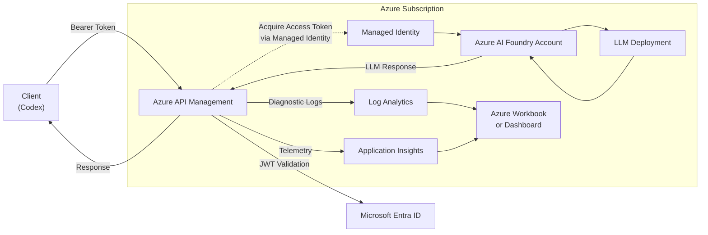
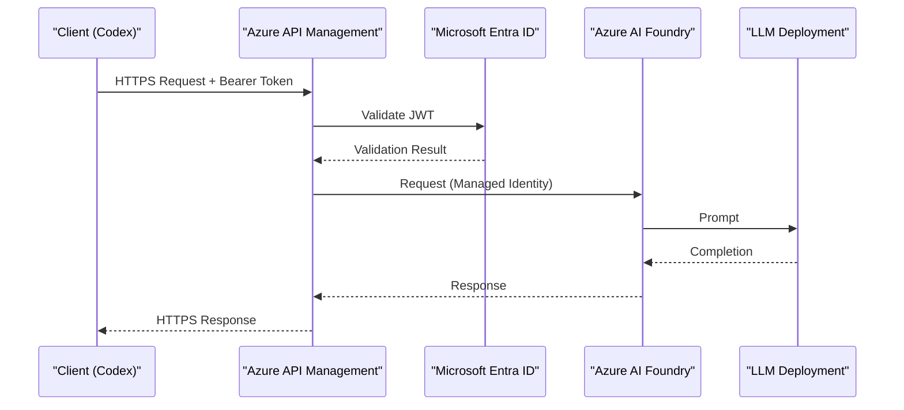
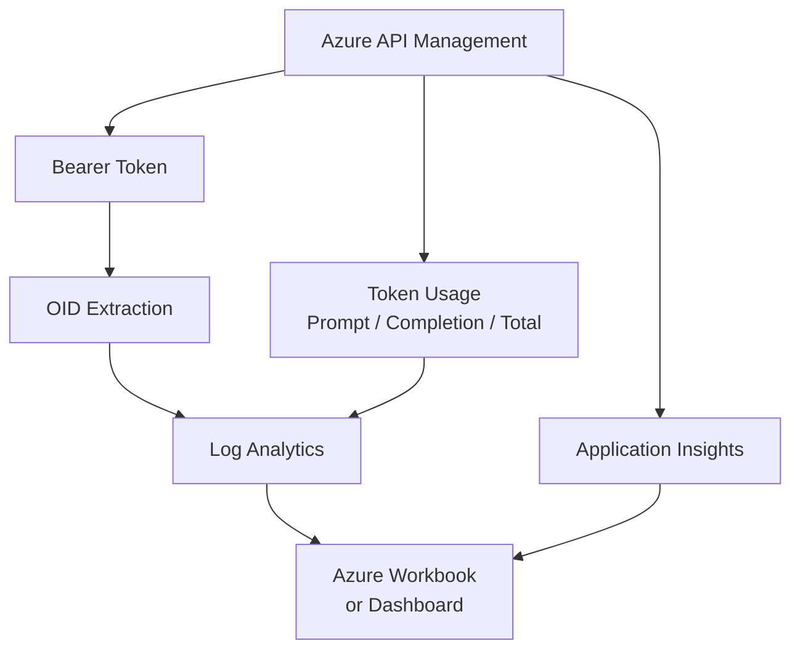

# diagram

## システム構成図

```mermaid
flowchart LR

    Client["Client<br/>(Codex)"]

    subgraph Azure["Azure Subscription"]

        APIM["Azure API Management"]

        Foundry["Azure AI Foundry Account"]

        Model["LLM Deployment"]

        MI["Managed Identity"]

        LA["Log Analytics"]

        AI["Application Insights"]

        Workbook["Azure Workbook<br/>or Dashboard"]

    end

    Entra["Microsoft Entra ID"]

    Client -->|"Bearer Token"| APIM

    APIM -->|"JWT Validation"| Entra

    APIM -.->|"Acquire Access Token<br/>via Managed Identity"| MI

    MI --> Foundry

    Foundry --> Model

    Model --> Foundry

    Foundry -->|"LLM Response"| APIM

    APIM -->|"Response"| Client

    APIM -->|"Diagnostic Logs"| LA

    APIM -->|"Telemetry"| AI

    LA --> Workbook

    AI --> Workbook
```

## リクエストシーケンス

```mermaid
sequenceDiagram

    participant Client as "Client (Codex)"
    participant APIM as "Azure API Management"
    participant Entra as "Microsoft Entra ID"
    participant Foundry as "Azure AI Foundry"
    participant LLM as "LLM Deployment"

    Client->>APIM: HTTPS Request + Bearer Token

    APIM->>Entra: Validate JWT

    Entra-->>APIM: Validation Result

    APIM->>Foundry: Request (Managed Identity)

    Foundry->>LLM: Prompt

    LLM-->>Foundry: Completion

    Foundry-->>APIM: Response

    APIM-->>Client: HTTPS Response
```

## 監査・メトリクス収集

```mermaid
flowchart TD

    APIM["Azure API Management"]

    Token["Bearer Token"]

    OID["OID Extraction"]

    Metrics["Token Usage<br/>Prompt / Completion / Total"]

    LA["Log Analytics"]

    AI["Application Insights"]

    Workbook["Azure Workbook<br/>or Dashboard"]

    APIM --> Token

    Token --> OID

    APIM --> Metrics

    OID --> LA

    Metrics --> LA

    APIM --> AI

    LA --> Workbook

    AI --> Workbook
```

