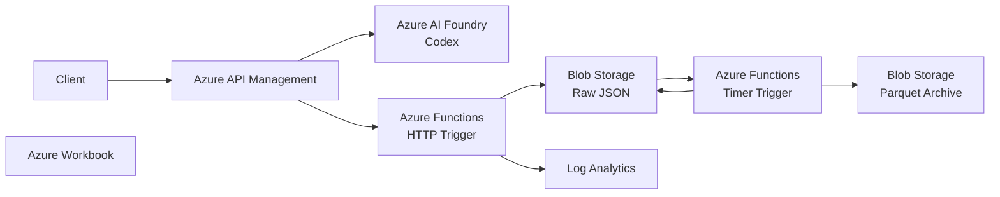
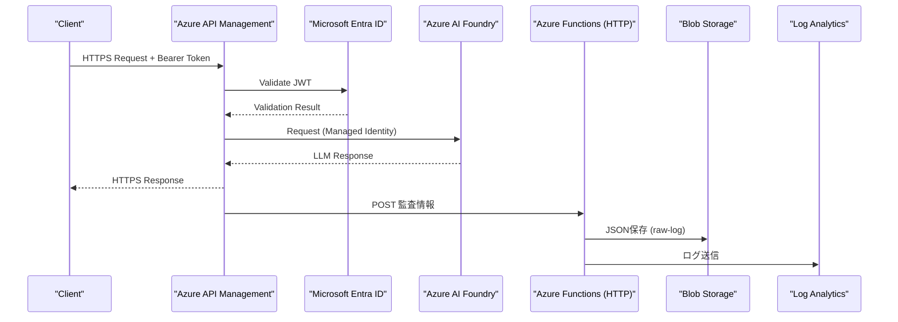
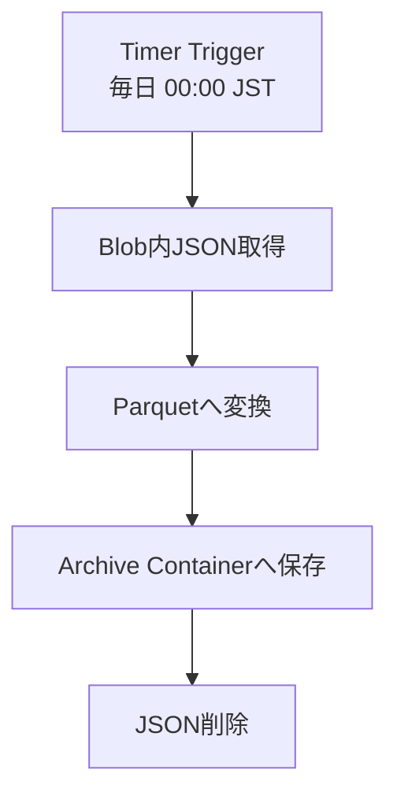

# システム構成図

## 監査ログ基盤 構成図

```mermaid
flowchart LR

Client["Client"]

APIM["Azure API Management"]

Foundry["Azure AI Foundry<br/>Codex"]

FuncHttp["Azure Functions<br/>HTTP Trigger"]

BlobHot["Blob Storage<br/>Raw JSON"]

FuncTimer["Azure Functions<br/>Timer Trigger"]

BlobArchive["Blob Storage<br/>Parquet Archive"]

LogAnalytics["Log Analytics"]

Workbook["Azure Workbook"]

Client --> APIM

APIM --> Foundry

APIM --> FuncHttp

FuncHttp --> BlobHot

FuncHttp --> LogAnalytics

FuncTimer --> BlobHot

BlobHot --> FuncTimer

FuncTimer --> BlobArchive
```

## データフロー シーケンス

```mermaid
sequenceDiagram

    participant Client as "Client"
    participant APIM as "Azure API Management"
    participant Entra as "Microsoft Entra ID"
    participant Foundry as "Azure AI Foundry"
    participant FuncHttp as "Azure Functions (HTTP)"
    participant Blob as "Blob Storage"
    participant LA as "Log Analytics"

    Client->>APIM: HTTPS Request + Bearer Token

    APIM->>Entra: Validate JWT

    Entra-->>APIM: Validation Result

    APIM->>Foundry: Request (Managed Identity)

    Foundry-->>APIM: LLM Response

    APIM-->>Client: HTTPS Response

    APIM->>FuncHttp: POST 監査情報

    FuncHttp->>Blob: JSON保存 (raw-log)

    FuncHttp->>LA: ログ送信
```

## 日次バッチ フロー

```mermaid
flowchart TD

    Timer["Timer Trigger<br/>毎日 00:00 JST"]

    GetJSON["Blob内JSON取得"]

    Convert["Parquetへ変換"]

    Save["Archive Containerへ保存"]

    Delete["JSON削除"]

    Timer --> GetJSON

    GetJSON --> Convert

    Convert --> Save

    Save --> Delete
```
