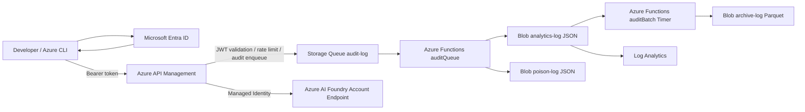
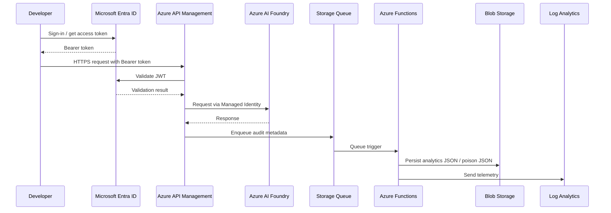
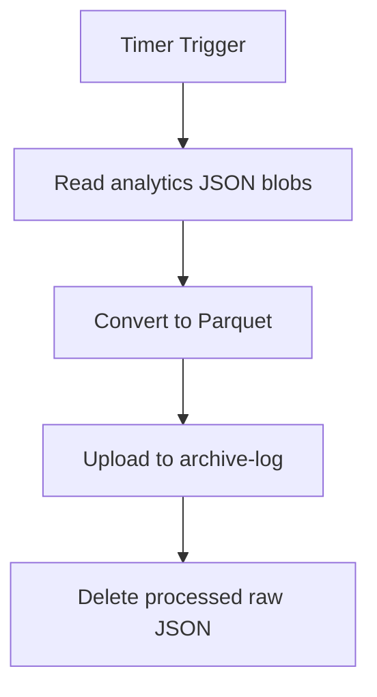

# システム構成図

## Azure AI Foundry Codex 基盤

```mermaid
flowchart LR
  Dev[Developer / Azure CLI] --> Entra[Microsoft Entra ID]
  Entra --> Dev
  Dev -->|Bearer token| APIM[Azure API Management]
  APIM -->|JWT validation / rate limit / audit enqueue| Queue[Storage Queue audit-log]
  APIM -->|Managed Identity| Foundry[Azure AI Foundry Account Endpoint]
  Queue --> FuncQueue[Azure Functions auditQueue]
  FuncQueue --> Analytics[Blob analytics-log JSON]
  FuncQueue --> Poison[Blob poison-log JSON]
  Analytics --> FuncTimer[Azure Functions auditBatch Timer]
  FuncTimer --> Archive[Blob archive-log Parquet]
  Analytics --> LAW[Log Analytics]
```

## ログ処理シーケンス

```mermaid
sequenceDiagram
  participant Dev as Developer
  participant Entra as Microsoft Entra ID
  participant APIM as Azure API Management
  participant Foundry as Azure AI Foundry
  participant Queue as Storage Queue
  participant Func as Azure Functions
  participant Blob as Blob Storage
  participant LAW as Log Analytics

  Dev->>Entra: Sign-in / get access token
  Entra-->>Dev: Bearer token
  Dev->>APIM: HTTPS request with Bearer token
  APIM->>Entra: Validate JWT
  Entra-->>APIM: Validation result
  APIM->>Foundry: Request via Managed Identity
  Foundry-->>APIM: Response
  APIM->>Queue: Enqueue audit metadata
  Queue->>Func: Queue trigger
  Func->>Blob: Persist analytics JSON / poison JSON
  Func->>LAW: Send telemetry
```

## 日次バッチフロー

```mermaid
flowchart TD
  Timer[Timer Trigger] --> Read[Read analytics JSON blobs]
  Read --> Convert[Convert to Parquet]
  Convert --> Archive[Upload to archive-log]
  Archive --> Cleanup[Delete processed raw JSON]
```
