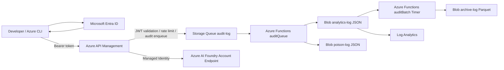

# Azure Infrastructure Build Specification

## AI Coding Agent Platform on Azure AI Foundry (Codex)

Version: 1.0

---

# 1. Objective

## Purpose

Azure AI Foundry上のCodexを利用する社内向けAIコーディングエージェント基盤を構築する。

本システムはAzure API Management（APIM）を唯一の公開エンドポイントとし、認証、認可、監査ログ、コスト分析およびアクセス制御を提供する。

Infrastructure as Code（IaC）はBicepを使用し、Azureリソースはすべてコードとして管理する。

---

# 2. Scope

本仕様に含まれる実装対象は以下とする。

- Azure Infrastructure
- Bicep
- Azure API Management
- APIM Policy
- Azure Functions
- Azure Storage
- Azure AI Foundry
- Monitoring
- Logging
- RBAC
- Diagnostic Settings

対象外

- クライアントアプリケーション
- CI/CD
- アプリケーションロジック

---

# 3. Design Principles

設計方針は以下を優先順位とする。

1. Security
2. Cost Optimization
3. Maintainability
4. Observability
5. Availability

本システムは少人数利用を前提とするため、高可用性よりも低コストを優先する。

Azureマネージドサービスを最大限利用し、運用負荷を最小化する。

---

# 4. Constraints

## Azure Permissions

利用可能権限

- Subscription Owner

利用不可

- Tenant Administrator
- Global Administrator

Tenantレベル設定を前提とした設計は禁止する。

---

## Infrastructure as Code

使用可能

- Bicep
- Azure Verified Modules (AVM)

使用禁止

- Terraform
- ARM Template
- Portal前提の構築
- 手動構築

Bicepは再実行可能（Idempotent）であること。

---

## Azure AI Foundry

CodexはAzure AI Foundry Account Endpointを利用する。

禁止事項

- Project Endpoint
- Azure OpenAI Endpoint
- API Key認証

理由

Project EndpointではTool Calling利用時にSchema破損が発生するため。

---

# 5. System Architecture



ログ処理

```text
APIM
  -> Storage Queue
  -> Azure Functions
  -> Analytics Blob (JSON)
  -> Poison Blob (JSON)
  -> Archive Blob (Parquet)
```

分析

```text
Analytics Blob -> Log Analytics
```

---

# 6. Azure Resources

- Resource Group
- Azure API Management
- Azure AI Foundry Account
- Storage Account
- Queue Storage
- Blob Storage
- Azure Functions
- Managed Identity
- Log Analytics Workspace

---

# 7. SKU

| Resource | SKU |
| --- | --- |
| API Management | Consumption |
| Azure Functions | Consumption |
| Storage Account | Standard LRS |
| Log Analytics | Pay-As-You-Go |

Premium SKUは禁止。

Always Onは禁止。

---

# 8. Authentication

## Client Authentication

開発者はAzure CLIを利用してMicrosoft Entra IDへサインインする。

```bash
az login
```

Bearer TokenはAzure CLIから取得する。

```bash
az account get-access-token
```

取得したBearer TokenをAuthorizationヘッダーへ設定しAPIMへ送信する。

---

## API Management

APIMでは以下を実施する。

- JWT Validation
- JWT Claims取得
- 利用者識別
- Correlation ID生成
- Queueへの監査ログ送信
- Managed IdentityによるAzure AI Foundry呼び出し

---

## Azure AI Foundry

Foundryへの認証はManaged Identityで実施する。

クライアントBearer TokenをFoundryへ転送してはならない。

API Keyは利用しない。

---

# 9. User Identification

利用者識別にはJWT Claimを利用する。

主キー

- oid

取得対象

- oid
- tid
- sub
- appid
- azp

取得可能な場合は保存する。

追加取得

- clientIp
- userAgent
- x-ms-client-request-id
- x-ms-request-id
- requestId
- correlationId
- traceparent

利用しない

- aud
- email
- upn

---

# 10. Logging

本文は一切保存しない。

保存対象

- timestamp
- oid
- tid
- sub
- appid
- azp
- model
- deployment
- operation
- Prompt Tokens
- Completion Tokens
- Total Tokens
- HTTP Status
- Backend Status
- Latency
- Backend Latency
- requestId
- correlationId
- traceparent
- clientIp
- userAgent

禁止

- Prompt
- Completion
- Tool Arguments
- Source Code
- Conversation
- 添付ファイル

---

# 11. Log Retention

| Purpose | Format | Retention |
| --- | --- | --- |
| Buffer | Queue | 1 hour |
| Analytics | JSON | 90 days |
| Poison | JSON | 14 days |
| Archive | Parquet | 2 years |

AnalyticsはLog Analyticsから検索可能とする。

Archiveは監査用途とする。

---

# 12. Queue Processing

APIMは同期的にBlobへ保存してはならない。

処理

Queue -> Functions -> Analytics(JSON)

失敗

Queue -> Functions -> Poison(JSON)

Timer Trigger -> Analytics -> Parquet変換 -> Archive

---

# 13. Security

## API Management

- HTTPSのみ
- TLS1.2以上
- JWT Validation必須
- Rate Limit
- Correlation ID生成
- BackendはManaged Identity

---

## Azure AI Foundry

- API Key禁止
- Managed Identity
- Account Endpointのみ
- Project Endpoint禁止

---

## Storage

- Shared Key禁止
- Shared Key Access無効
- SAS禁止
- Public Blob Access禁止
- HTTPSのみ
- RBAC
- Managed Identityのみ

---

## Azure Functions

- Managed Identity
- StorageはEntra認証
- Function Keyによる公開禁止

---

## Network

攻撃面を最小化する。可能な限り適用する。

- Public Network Access無効
- IP制限
- RBAC最小権限
- Managed Identity
- Private Endpoint（利用可能なリソース）
- Private DNS（利用可能な構成）

---

# 14. Monitoring

Analytics BlobをLog Analyticsへ接続する。

検索対象

- oid
- tid
- model
- deployment
- token数
- Status Code
- 呼び出し回数
- latency


---

# 15. Implementation

## Bicep

AzureリソースはBicepのみで構築する。

AVMを優先利用する。

推奨構成

```text
infra/
  main.bicep
  modules/
  parameters/
```

---

## API Management

PolicyはXMLとして管理する。

Bicepへ埋め込まない。

構成

- inbound.xml
- backend.xml
- outbound.xml
- on-error.xml

実装内容

- JWT Validation
- Claim取得
- oid取得
- Correlation ID生成
- Queue送信
- Managed Identity認証
- Rate Limit

---

## Azure Functions

言語

TypeScript

Runtime

Node.js LTS

Function

- Queue Trigger
- Timer Trigger
- Poison Handler

---

# 16. Repository Structure

```text
infra/
  main.bicep
  modules/
  parameters/
  apim/
  functions/
  docs/
```

---

# 17. Deliverables

## Infrastructure

- Bicep
- AVM Modules
- Parameters
- RBAC
- Diagnostic Settings

## API Management

- Policy XML
- API Definition
- Backend Definition
- Named Values

## Azure Functions

- TypeScript
- package.json
- host.json
- JSON Schema
- Parquet変換処理

## Documentation

- README
- デプロイ手順
- Mermaid構成図
- シーケンス図
- ログ仕様
- 運用手順

---

# 18. Non-functional Requirements

- APIMはConsumptionを利用する
- Azure FunctionsはConsumptionを利用する
- ログは完全非同期処理とする
- API応答はログ保存を待機しない
- Queue障害時でもAPI応答へ影響を与えない
- AnalyticsとArchiveを分離する
- ArchiveはParquet形式とする
- 本文は一切保存しない
- Managed Identityを基本認証方式とする
- 最小権限の原則を適用する
- 可能な限りPublic Exposureを削減する
- 可能な限りIP制限を適用する
- Azureリソースはタグ付けを実施する
- Bicepはモジュール化する
- PolicyはXMLとして分離する
- Azure FunctionsはTypeScriptで実装する
- 保守性と再利用性を考慮した構成とする

```
log-http/

log-batch/
```

責務分離を徹底する。

---

# 12. コスト最適化

Event Hubsを利用しない。

JSONを即時Parquet化しない。

日次バッチにまとめることで

- Storage Transaction
- Functions実行回数
- CPU利用時間

を最小化する。

想定ログ件数（1万件/日未満）ではConsumption Planで十分運用可能である。

---

# 13. 採用理由

## Event Hubs採用時

- Namespace管理
- Throughput Unit
- Capture
- Functions Trigger

が必要となる。

監査ログ規模ではオーバースペックである。

## 本構成

HTTP Triggerのみで受信し、

Blobをキュー代替として利用することで

十分な耐障害性と低コストを実現する。

年間運用コストを抑えつつ、監査証跡として必要な保存要件（2年間）を満たす。
