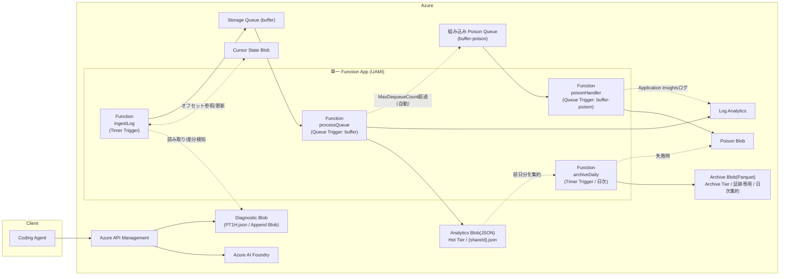

# Azure Functions 仕様書

## APIM - Azure AI Foundry 通信ログ収集パイプライン

> **Version:** 2.3
> **Status:** Draft（実装着手可能レベル）
> **Target Runtime:** Azure Functions v4 / TypeScript / Node.js 20 / Consumption Plan (classic)
> **関連仕様書:** インフラ構成（APIM / Storage / Log Analytics DCR・DCE / RBAC割り当て / Alert Rule等）は `Bicep_IaC_仕様書.md`（別紙）を参照。本書はFunction実装（ingestLog / processQueue / poisonHandler / archiveDaily）に専念する。

---

# 1. 改訂履歴

| 版 | 日付 | 内容 |
| --- | --- | --- |
| 1.0 | 2026-07-10 | 初版 |
| 2.0 | 2026-07-12 | Event Hub廃止、Blob Trigger構成へ変更、Managed Identity + RBAC対応、ShareId仕様変更、Poison Blob対応、Node.js20固定化 |
| 2.1 | 2026-07-12 | Blob Trigger方式（Polling）確定、Bicep(IaC)を別仕様書へ分離、Function App構成を単一化、User-assigned Managed Identity採用、JWT検証・レート制限のパラメータ化方針確定、APIM Diagnostic出力形式確定、apiName/operationName取得元確定、dev単一環境方針確定 |
| 2.2 | 2026-07-12 | **【重大修正】** ingestLogをBlob Trigger(Polling)からTimer Trigger+カーソル管理方式へ変更（Diagnostic BlobがAppend Blobのため、Blob Triggerの blob receipt 機構により大半のログが再処理されず欠落するリスクを解消）。Poison Blob実装をFunction3(poisonHandler)として独立化（Storage Queue Triggerの組み込みPoisonQueue機構`<queue>-poison`を活用）。Archive Tierへの直接アップロード方法（低レベルupload API使用必須）とオフライン特性（読み取り不可・要リハイドレート）を明記し、可視化はHot Tier(Analytics)のみで行い、Archive Tierは証跡保管専用とする方針を明記 |
| 2.3 | 2026-07-12 | レビュー指摘10項目を反映。Cursorをbyte offset方式に確定（完全な改行までを処理境界とする）／Range Downloadを明示的に採用／Queue重複はAnalytics・Archiveのファイル名決定論化（冪等化）とLog Analyticsクエリ側デデュープ(`arg_max`)で吸収／**Archive Parquet生成をprocessQueueから分離し、Function4「archiveDaily」による日次バッチ生成に変更**（コスト・性能改善）／Timer Triggerの組み込みシングルトン保証を確認し追加対策不要と結論／LogRecordに`schemaVersion`を追加しスキーマ管理方針を明記／Archive失敗をリアルタイム経路から分離／processQueue内でAnalytics書き込みをLog Analytics送信より先行させ障害分離／Queueメッセージサイズ(48KB)の事前検証を追加／Poison発生時の通知をApplication Insightsログ+Alert Ruleの構成で確定 |

---

# 2. 目的

本システムは、Azure API Management(APIM)を経由して Azure AI Foundry（Codex等）を利用する社内向けコーディングエージェント基盤において、APIMを唯一の公開エンドポイントとし、その通信メタデータを取得して利用分析・監査・障害解析を目的として保管する。

対象は社内利用（50名未満）とし、運用コストを最小限に抑えながらセキュアなログ収集基盤を提供する。

---

# 3. システム概要

* APIMの診断ログをBlob Storageへ出力（Diagnostic Settings、Append Blobとして1時間単位で継続追記される）
* Azure Functions（Timer Trigger + カーソル管理方式）で差分検知・非同期処理
* Storage Queueでバッファリング
* Analytics用JSON保存（Hot Tier、可視化用途）
* Archive用Parquet保存（Archive Tier、証跡保管専用。可視化には使用しない）
* Log Analyticsへ取り込み
* 異常データは組み込みPoison Queue経由でPoison Blobへ保存

---

# 4. 設計方針

## 採用

* Azure Functions Consumption Plan（classic）
* **Timer Trigger + カーソル管理方式**（ingestLog用。Diagnostic BlobがAppend Blobであり、Blob Triggerのblob receipt機構では追記分を再検知できないため採用）
* Timer Trigger（archiveDaily用。Archive Parquetの日次バッチ生成）
* Queue Trigger（processQueue用）
* Queue Trigger（**組み込みPoison Queue** `buffer-poison` をトリガーとするpoisonHandler用）
* Storage Queue
* Blob Storage
* Log Analytics Logs Ingestion API
* **User-assigned Managed Identity（UAMI）**
* Azure RBAC
* TypeScript
* Node.js 20
* 単一 Function App（ingestLog / processQueue / poisonHandler / archiveDaily を同一App内にホスト）

## 不採用

* Event Hub
* Event Grid（Blob Trigger連携含む）
* **Blob Trigger（Polling方式含む）**：Diagnostic Blob（Append Blob）の追記を継続的に検知できないため不採用（詳細は11章参照）
* HTTP Trigger
* Shared Key
* SAS
* Connection String
* System-assigned Managed Identity（UAMIに統一するため不採用）

---

# 5. システム構成



---

# 6. リアルタイム性

本システムは監査・利用分析用途であり、リアルタイム処理を目的としない。

Timer Trigger（定期実行によるカーソルベースの差分読み取り）および Blob Storage経由処理のため、

* 数分〜数時間程度の遅延

を許容する。Azure Monitorへの取り込み時間は保証対象外とする。

## Timer Trigger実行間隔の根拠

APIM Diagnostic Settingsの通常運用時のエクスポート遅延は約3分だが、リソースが1時間以上非アクティブな場合は15分、7日間非アクティブな場合は最大2時間までバックオフする（Azure Monitorの仕様）。本システムは日中の業務利用が主であるため、`INGEST_TIMER_SCHEDULE` は **5分間隔**（`0 */5 * * * *`）を初期値とする。夜間・休日等の低頻度時間帯はバックオフの影響で取得までの遅延が増えるが、本章で許容する「数分〜数時間」の範囲内であり問題としない。

---

# 7. APIM仕様

## JWT検証

APIMにて `validate-jwt` を実施する。Functionsでは署名検証を行わない。

* **テナント方針**: 単一テナント（Entra ID）を前提とする。
* **issuer / audience**: 具体値はハードコードせず、APIM Policy内では **Named Values（パラメータ）** として外だしする。値そのものは本仕様書では確定せず、Bicep側（別紙）から注入する想定とし、Policy XML上は `{{jwt-issuer}}` `{{jwt-audience}}` のようなプレースホルダー参照とする。

## 利用制限

利用者単位でレート制限を実施する。

優先順位

```
oid
↓
sub
```

APIM Policy `rate-limit-by-key` を利用する。

* **具体値（req数・期間）はハードコードしない**。Named Values（例: `{{rate-limit-calls}}` `{{rate-limit-renewal-period}}`）としてパラメータ化し、Bicep/Config側（別紙）で環境ごとに設定する列挙型パラメータとする。

## ShareId

APIMにてUUIDv4を生成する。既存ShareIdは使用しない。traceparentも利用しない。

生成したShareIdを `x-ms-share-id` として

* Foundryへ転送
* Response Headerへ付与

する。

## Diagnostic Settings 出力フォーマット

APIMのDiagnostic SettingsからBlobへの出力は **バッチされたJSON Lines形式**（1行1リクエストのJSON、複数行が1つのBlobにまとめられる）とする。ingestLog はこの前提でBlob内容を1行ずつパースする実装とすること。

---

# 8. 取得対象

## 保存するもの

* Request Metadata
* Response Metadata
* Status Code
* Latency
* API情報
* 利用者識別情報

## 保存しないもの

* Request Body
* Response Body
* Authorization Header
* JWT
* Cookie

---

# 9. JWT情報

| 項目 | 取得元 |
| --- | --- |
| subjectId | oid→sub |
| tenantId | tid |
| userPrincipalName | upn→preferred_username |
| appId | appid→azp |

JWT本体は保存しない。

---

# 10. LogRecord

```json
{
  "schemaVersion": "1.0",
  "shareId": "",
  "eventTime": "",
  "httpMethod": "",
  "routePath": "",
  "apiName": "",
  "operationName": "",
  "statusCode": 200,
  "latencyMs": 100,
  "clientIp": "",
  "identity": {
    "subjectId": "",
    "tenantId": "",
    "userPrincipalName": "",
    "appId": ""
  },
  "source": "apim"
}
```

## Schema Versioning方針

* `schemaVersion` はLogRecordの必須フィールドとし、Analytics JSON / Archive Parquet（列として保持） / Poison Blobの`rawMessage`にも一貫して含める。
* **加算的変更のみ**（新規フィールドの追加、nullable項目の追加）はマイナーバージョンを上げずに許容する。
* **破壊的変更**（フィールド削除・型変更・リネーム）は `schemaVersion` のメジャー値を上げ、旧バージョンとの並行稼働期間（Log Analyticsクエリ・Workbook側の両対応）を設けてから旧バージョンを廃止する。
* Log Analytics Custom Table（19章）は列の追加は安全だが、削除・リネームはテーブル再作成が必要になるため、破壊的変更時は新テーブル（例: `CodingAgentLogsV2_CL`）を作成し移行する方針とする。

## Analytics / Archive のファイル命名規則（冪等性の確保）

Storage Queueは Exactly-once を保証しない（ingestLogのリトライやprocessQueueの再試行により同一LogRecordが複数回処理される可能性がある）。この重複を後続処理側で吸収するため、以下の命名規則を採用する。

* **Analytics**: `analytics/yyyy/MM/dd/{shareId}.json`（1リクエスト=1ファイル。`shareId`はAPIMがUUIDv4で生成する一意な値のため、同一内容の再書き込みは同一ファイルへの上書きとなり冪等）
* **Poison Blob**: `poison/{functionName}/{errorTime}_{shareIdまたはmessageId}.json`

Log Analytics（Logs Ingestion API）は上記のような上書きによる冪等性を持たない（送信するたびに新しい行として記録される）ため、重複はクエリ側で吸収する（後述）。

## apiName / operationName の取得元

APIMのコンテキスト変数（`context.Api.Name` に相当する `operationId` 系の値、および `context.Operation.Name`）を **そのままマッピングして使用する**。Diagnostic Log出力内に含まれるAPIM標準フィールド（例: `apiId`, `operationId` に相当するプロパティ）をそのまま `apiName` / `operationName` に代入する実装とし、独自の変換・正規化は行わない。

---

# 11. Function構成

**単一 Function App** 内に以下4つのFunctionをホストする。デプロイ・スケーリング単位は共通とする。

## Function1: ingestLog

### 採用理由（重要）

APIM Diagnostic Settingsは、Blobを `insights-logs-{category}/.../y=/m=/d=/h=/m=00/PT1H.json` という**1時間単位のAppend Blob**として出力し、その1時間の間、新しいログが発生するたびに**同一Blobへ継続的に追記**する。

一方、Azure Functionsの classic Blob Trigger（Polling方式）は「blob receipt」という仕組みにより、**同一Blobに対して関数を1回しか実行しない**ことを保証する設計になっている。そのため、Blob Triggerを採用した場合、`PT1H.json` が最初に作成された時点で1回だけingestLogが発火し、その後1時間の間に追記される大半のログが再検知されず取りこぼされる。これは監査ログ収集という本システムの目的上、致命的な欠陥となるため、**Timer Trigger + カーソル管理方式**を採用する。

### Trigger

**Timer Trigger**（5分間隔を初期値とする。`0 */5 * * * *`。根拠は6章参照。具体的な間隔はアプリケーション設定 `INGEST_TIMER_SCHEDULE` でCRON形式パラメータ化する）

多重起動については、Timer TriggerはAzureWebJobsStorageを用いたBlobリースによる**組み込みのシングルトン保証**を持ち、Function Appがスケールアウトしても同時に1インスタンスしか実行されないため、追加の排他制御は不要（リース喪失時の稀な重複実行はカーソル更新順序の設計により許容範囲内。詳細は本章「カーソル管理」参照）。

### カーソル管理（Byte Offset方式）

* カーソルは **Byte Offset** 方式で管理する（行番号方式は毎回Blob全体の再読込・再カウントが必要になり非効率なため不採用）。
* カーソル状態Blob（`cursor/{diagnosticBlobパス}.json` 等）に `{ "offset": number, "lastUpdated": string }` を保存する。
* Blob読み取りは **Range Download**（`BlobClient.download(offset, count)`）を使用し、前回オフセット以降の**差分バイトのみ**を取得する（Blob全体の再ダウンロードによるI/O・コスト増を避けるため）。
* Diagnostic BlobはAzure Monitorによって書き込み中である可能性があるため、読み取った差分データの**末尾が改行(`\n`)で終わっていない場合、その未完成な最終行は今回処理せず**、直前の完全な改行位置までを処理対象とする。カーソルは「処理した最後の完全な行の直後のバイト位置」まで進める（未処理の末尾データは次回Timer実行時に再度読み取られる）。

### 処理

1. 現在時刻を基に、対象となる `PT1H.json` のBlobパス（当該時間帯 + 直前の時間帯の2つ。時間境界をまたぐ追記漏れを防ぐため）を特定する
2. カーソル管理用の状態Blobを読み取り、前回処理済みのバイトオフセットを取得する（初回はoffset=0）
3. 対象BlobをRange Downloadし、オフセット以降の差分のみを取得する
4. 取得した差分のうち、最後の完全な改行までをJSON Lines形式として1行ずつ解析する
5. JWTデコード（署名検証は行わない）
6. ShareId取得
7. LogRecord生成（`schemaVersion`を含む。10章参照）
8. **メッセージサイズ検証**：Storage Queueの1メッセージあたりの上限（64KB）に対し安全マージンを見て、シリアライズ後のLogRecordが**48KBを超える場合はQueue送信をスキップし、直接Poison Blobへ保存する**（サイズ超過は再送しても解消しないため。詳細は14章）
9. サイズ検証を通過したLogRecordをStorage Queue（`buffer`）へ送信
10. 送信が成功した行までカーソル（オフセット、＝処理した最後の完全な行の直後の位置）を更新して状態Blobへ書き戻す（キュー送信前にカーソルを進めてはならない。障害時の二重処理を許容し、欠落は許容しない設計とする）

### 異常時

* 行単位でのJSON解析失敗（当該行をスキップしログ出力した上で処理継続。システム停止は禁止。詳細は14章）
* メッセージサイズ超過（上記8参照。直接Poison Blobへ記録しカーソルは進める）
* Storage Queueへの送信失敗（カーソルを更新せず、次回Timer実行時に同じ範囲を再送信する。Queue送信は冪等でない可能性があるため、processQueue側でのShareId等による重複排除は行わず、Analytics/Archiveはファイル名の決定論的命名により冪等吸収し、Log Analyticsはクエリ側デデュープで吸収する。詳細は10章）
* Function自体の実行失敗（Timer Triggerにはコード側でFunction単位のリトライポリシー（`fixedDelay`または`exponentialBackoff`、最大3回）を設定し、自動リトライさせる。`host.json`のグローバル`retry`設定は使用しない。processQueue（Queue Trigger）の再試行制御と干渉させないためであり、詳細は24章参照。処理停止は禁止する）

## Function2: processQueue

Trigger: Storage Queue Trigger（`buffer`）

処理（**Archive生成は含まない。Function4 archiveDailyへ分離。理由は17章参照**）:
1. 必須項目確認
2. **Analytics JSON生成**（Hot Tier、`analytics/yyyy/MM/dd/{shareId}.json` へ書き込み。決定論的ファイル名のため重複処理は冪等な上書きとなる）を**先に完了**させる
3. Analytics書き込み成功後、**Log Analytics送信**を行う

**障害分離の方針**: Analytics書き込みを常に先行させることで、Log Analytics側の障害（一時的な送信失敗等）がAnalytics（Workbook等の可視化の主経路）に影響しない設計とする。Log Analytics送信が失敗した場合のみ例外をスローし、メッセージ全体を再試行させる（Analytics書き込みは冪等な上書きのため再試行しても問題ない。Log Analyticsは重複送信され得るが、19章のクエリ側デデュープ方針で吸収する）。

処理が失敗した場合は例外をスローし、Azure Functionsの**組み込みQueue Trigger再試行機構**に委ねる（`host.json`の`maxDequeueCount`回まで自動リトライ後、`buffer-poison`キューへ自動移動。詳細は12・14・15章参照）。processQueue自身がPoison Blobへの書き込みを行うことはない。

## Function3: poisonHandler

### 採用理由

Azure Functionsの Storage Queue Trigger は、メッセージ処理が `maxDequeueCount` 回失敗すると、**関数側に一切通知することなく**自動的に `<queue名>-poison`（本システムでは `buffer-poison`）という組み込みのPoison Queueへメッセージを移動する。この移動をトリガーとして処理するFunctionが存在しないと、15章で定義するPoison Blobへの保存が実現できないため、専用のpoisonHandlerを設ける。

### Trigger

Storage Queue Trigger（`buffer-poison`）

### 処理

1. `buffer-poison` キューのメッセージを受信する（メッセージには元の `buffer` キューメッセージ本文に加え、Azure Functionsランタイムが付与するメタデータ（DequeueCount、InsertionTime、FunctionId等）が含まれる）
2. 15章のPoison Blobフォーマットへマッピングして生成
3. Poison Blobコンテナへ保存
4. **Application Insightsへ構造化エラーログ（`context.error()`等）を出力する**。ログには最低限 `poisonBlobPath`（保存先パス）、`functionName`（元の失敗元）、`errorType` を含める。このログはAzure Monitor Alert Rule（Bicep側で構成、30章参照）の発火条件として利用される

poisonHandler自体の処理が失敗した場合も、システム停止を避けるため十分にリトライ耐性を持たせ、最終的に失敗してもログ出力のみに留め処理を継続する（Poison BlobのPoison Blob、という無限ループを防ぐため、poisonHandlerの失敗はこれ以上Poison化しない）。

## Function4: archiveDaily（新設）

### 採用理由

Archive Parquetをprocessqueue内でメッセージ単位（1リクエスト=1ファイル）に生成すると、Parquet本来の列指向フォーマットとしての利点（多数行をまとめて圧縮・圧縮効率を高める）が活きず、ファイル数増加によるトランザクションコスト増・ストレージ効率の悪化を招く。Archiveは17章の通り証跡保管専用でありリアルタイム性を要求しないため、**日次バッチ処理へ分離**する。

### Trigger

Timer Trigger（日次、例: 毎日 03:00 UTC実行。具体的な時刻はアプリケーション設定 `ARCHIVE_TIMER_SCHEDULE` でパラメータ化する。ingestLogと同様、組み込みシングルトン保証により多重実行は発生しない）

### 処理

1. 前日分（UTC日付）のAnalytics JSON（`analytics/yyyy/MM/dd/*.json`）を全件列挙・取得する
2. 取得した全LogRecordを1つのParquetファイルにまとめる（`schemaVersion`列を含む）
3. `archive/yyyy/MM/dd/{yyyy-MM-dd}.parquet` へ、低レベルの `upload()` APIで `tier: 'Archive'` を明示的に指定してアップロードする（簡易メソッドはTier指定に対応していないため使用しないこと）

### 異常時

* 処理対象日のParquet生成・アップロードに失敗した場合、コード側のFunction単位リトライポリシー（最大3回）で再試行する
* それでも失敗した場合は、当該日付の処理失敗を示すレコードをPoison Blob（`poison/archiveDaily/{date}.json`）へ記録し、**当日の処理は失敗として終了するが、翌日以降のスケジュール実行はブロックしない**（過去日への遡及リトライは行わず、必要に応じて手動での再実行（バックフィル）を別途実施する。30章の将来検討事項を参照）
* Archiveの失敗はAnalytics・Log Analyticsという既に完了しているリアルタイム経路には一切影響しない（証跡保管という位置づけ上、可用性よりも正確性を優先し、失敗時は隠蔽せず記録に残す）

---

# 12. Queue設計

## buffer（メインキュー）

用途: ingestLog → processQueue 間バッファ

認証: User-assigned Managed Identity

最大リトライ: 3回（`host.json`の`maxDequeueCount`で制御）

## buffer-poison（組み込みPoison Queue）

`buffer` キューのメッセージが `maxDequeueCount` 回失敗すると、Azure Functionsランタイムが**自動的に**作成・登録する組み込みキュー。ユーザー側でのプロビジョニング（Bicep等）は不要（初回のPoison発生時に自動生成される）。poisonHandler（Function3）がこれをTriggerとして監視する。

Queueが停止しないことを最優先とする。

---

# 13. 正常系

一部項目取得不可の場合（例: `statusCode` が取得できない）は `null` として保存する。例外としない。Analytics / Archive / Log Analytics すべてへ保存する。

---

# 14. 異常系

以下は異常と判定する。

* JSON破損
* shareId欠落
* eventTime欠落
* Blob書込み失敗
* Log Analytics送信失敗
* Storage Queueへの送信失敗（ingestLog側、詳細は11章）
* メッセージサイズ超過（64KB制限に対し48KBを閾値とする。ingestLog側、詳細は11章）
* Parquet生成失敗（archiveDaily側、詳細は11・17章。processQueueの異常系フローとは独立して扱う）

processQueue（Function2）における処理:

```
例外throw → (Azure Functions組み込み)Retry → Retry → Retry
  → maxDequeueCount超過 → buffer-poison キューへ自動移動
  → poisonHandler（Function3）が検知 → Poison Blobへ保存 → 正常終了
```

上記はAzure Functionsランタイムの組み込みQueue Trigger再試行・Poison Queue機構に委ねる設計とし、processQueue自身でリトライ回数を管理するロジックは実装しない（詳細は11・12・15章）。

処理停止は禁止する。

---

# 15. Poison Blob

用途: 障害解析

生成経路: poisonHandler（Function3）が `buffer-poison` キューのメッセージを受信し、以下の形式で生成・保存する（詳細は11章）。

保存内容:

```json
{
  "errorTime": "",
  "retryCount": 3,
  "functionName": "",
  "exceptionType": "",
  "errorMessage": "",
  "stackTrace": "",
  "rawMessage": {}
}
```

保持: 14日。再処理対象ではない。

**通知/アラート**: poisonHandler（Function3）がPoison Blob保存と同時にApplication Insightsへ構造化エラーログを出力し（11章参照）、これをトリガーとする **Log-based Alert Rule**（Azure Monitor、Action Group連携）をBicep側（別紙）で構成する。Function側の実装要件は「アラートに必要な情報を構造化ログとして出力すること」のみであり、アラートルール自体のプロビジョニングは本仕様書のスコープ外とする。

---

# 16. Analytics

形式: JSON

保存先: `analytics/yyyy/MM/dd/{shareId}.json`（1リクエスト=1ファイル。`shareId`をファイル名に用いることで、重複処理は同一ファイルへの冪等な上書きとなる。詳細は10章「Analytics / Archive のファイル命名規則」参照）

保持: 90日（Hot Tierを使用する）

---

# 17. Archive

形式: Parquet

**生成タイミング: 日次バッチ（Function4 archiveDaily）。processQueue（Function2）内でのメッセージ単位生成は行わない。理由・詳細は11章参照。**

保存先: `archive/yyyy/MM/dd/{yyyy-MM-dd}.parquet`（1日分のAnalytics JSONを集約した単一ファイル）

保持: 730日（Archive BlobはArchive Tierを使用する。Cool Tierへの移行は行わない。Archiveが最終Tierであり、保持期間（730日）満了後は削除する）

**ライブラリ選定について**: Node.js/TypeScriptでのParquet書き込みに適したライブラリの選定は実装エージェントが調査・決定する。ただし以下を必須条件とする。

* 積極的にメンテナンスされている（直近1年以内の更新実績があること）
* Node.js 20 / TypeScriptで型定義が利用可能、またはESM/CJS双方に対応
* 選定したライブラリ名・バージョン・選定理由をコード内コメントおよびREADMEに明記すること
* 候補が見つからない場合はParquet生成を諦めず、Apache Arrow経由での生成等の代替実装手段も検討すること

## Archive Tierへの直接アップロードに関する実装上の注意

* Archive Tierへの直接書き込みは、Azure Blob Storage SDK for JavaScript/TypeScriptの `BlockBlobClient.upload()`（低レベルAPI）に `{ tier: 'Archive' }` を指定することで可能。**`uploadData()` / `uploadFile()` / `uploadStream()` 等の簡易メソッドはアップロード時のTier指定に対応していない**ため、Archive生成処理では必ず `upload()` を使用すること。
* Archive Tierのblobは**オフライン状態**であり、リハイドレート（オンライン層への復元、数時間〜1日程度を要する）を行わない限り**読み取り・変更が一切できない**。
* Archive Tierは180日未満での削除・上位Tierへの変更に早期削除料金が発生するが、本システムの保持期間（730日）はこれを十分に上回るため通常運用では問題にならない。

## 用途の明確化（可視化とアーカイブの分離）

* **可視化・ダッシュボード用途（Azure Workbook等）は、常にHot Tierの Analytics Blob（16章）または Log Analytics（18章）を参照する。Archive Blob（Archive Tier）は参照しない。**
* Archive BlobはAPIM通信の**証跡保管専用**とし、監査・コンプライアンス目的でのみ利用する。参照が必要になった場合は、事前にリハイドレートを行うオペレーションを別途実施する（本仕様書のスコープ外。将来検討事項として30章に記載）。

---

# 18. Log Analytics

Logs Ingestion APIを利用する。

認証: User-assigned Managed Identity

構成:

```
Function → DCE → DCR → CodingAgentLogs_CL
```

DCE/DCRの作成はBicep側（別紙）で行う。Function側は `LOG_ANALYTICS_DCE_ENDPOINT` / `LOG_ANALYTICS_DCR_ID` / `LOG_ANALYTICS_STREAM_NAME` をアプリケーション設定から参照する。

---

# 19. Custom Table

| 列名 | 型 |
| --- | --- |
| TimeGenerated | datetime |
| SchemaVersion | string |
| ShareId | string |
| SubjectId | string |
| TenantId | string |
| UserPrincipalName | string |
| AppId | string |
| ApiName | string |
| OperationName | string |
| Method | string |
| Route | string |
| StatusCode | int |
| LatencyMs | int |
| ClientIp | string |
| Source | string |
| CreatedAt | datetime |

## 重複データのデデュープ方針

Logs Ingestion APIには冪等性がなく、processQueueの再試行（11章）により同一`ShareId`の行が複数回記録される可能性がある。Log Analytics側での重複排除・上書きは行わず、**クエリ側（Workbook等）でのデデュープを正式な方針とする**。KQLクエリの例:

```kql
CodingAgentLogs_CL
| summarize arg_max(TimeGenerated, *) by ShareId
```

この方針により、Function側の実装をシンプルに保ちつつ、可視化結果の正確性を確保する。破壊的なスキーマ変更時の移行方針は10章を参照。

---

# 20. Storage構成

```
analytics/       ← {shareId}.json 単位（10・16章）
archive/          ← {yyyy-MM-dd}.parquet 単位、archiveDailyが日次生成（11・17章）
poison/
cursor/           ← ingestLogのTimer Trigger差分検知用カーソル状態を保存
```

Storage Queue:
```
buffer          （メインキュー）
buffer-poison   （組み込みPoison Queue。Azure Functionsランタイムが自動生成。手動プロビジョニング不要）
```

---

# 21. 認証

すべて **User-assigned Managed Identity** を利用する。

* Storage（Blob / Queue）
* Log Analytics

すべて Azure RBAC でアクセスする。

---

# 22. 必要RBAC

* Storage Blob Data Contributor
* Storage Queue Data Contributor
* Azure Event Hubs Data Receiver（※将来的な拡張時のみ。現構成では不要）
* Monitoring Metrics Publisher
* Data Collection Rule Data Sender

UAMIへのロール割り当てはBicep側（別紙）で実施する。

---

# 23. ネットワーク構成

* **APIM**: 唯一の公開エンドポイントとする。
* **Storage / Log Analytics 等バックエンドリソース**: 現時点では **Public エンドポイント** とし、Azure RBAC（Managed Identity経由の認証・認可）のみで保護する。Private Endpoint / VNET統合による非公開化は行わない。
* 将来的なネットワーク強化（Private Endpoint化等）は28章の検討事項とする。

---

# 24. host.json

```json
{
  "version": "2.0",
  "extensions": {
    "queues": {
      "batchSize": 16,
      "visibilityTimeout": "00:00:30",
      "maxDequeueCount": 3
    }
  }
}
```

**注意**: `host.json` トップレベルの `retry` ブロックはホスト内の対応する全トリガー（Timer / Queue含む）に一括適用されるため、**ここでは設定しない**。ingestLog（Timer Trigger）の再試行は、Function単位で個別に設定できるコード側の retry オプション（Programming Model v4の `app.timer()` 登録時の `retry` プロパティ）で行い、processQueue（Queue Trigger）の再試行制御（`queues.maxDequeueCount`）と干渉しないようにすること。

---

# 25. アプリケーション設定

| 設定 | 用途 |
| --- | --- |
| STORAGE_ACCOUNT_URL | Storage |
| QUEUE_NAME | Queue（`buffer`） |
| ANALYTICS_CONTAINER | Analytics |
| ARCHIVE_CONTAINER | Archive |
| POISON_CONTAINER | Poison |
| CURSOR_CONTAINER | カーソル状態保存用コンテナ（`cursor/`） |
| DIAGNOSTIC_LOG_CONTAINER | APIM Diagnostic Settings出力先コンテナ名（ingestLogの読み取り対象） |
| INGEST_TIMER_SCHEDULE | ingestLogのTimer Trigger実行間隔（CRON形式。例: `0 */5 * * * *`） |
| ARCHIVE_TIMER_SCHEDULE | archiveDailyのTimer Trigger実行時刻（CRON形式。例: `0 0 3 * * *` = 毎日03:00 UTC） |
| QUEUE_MESSAGE_MAX_BYTES | ingestLogのQueue送信サイズ閾値（既定48000。11章参照） |
| LOG_ANALYTICS_DCE_ENDPOINT | DCE |
| LOG_ANALYTICS_DCR_ID | DCR |
| LOG_ANALYTICS_STREAM_NAME | Stream |
| AZURE_CLIENT_ID | User-assigned Managed IdentityのClient ID（DefaultAzureCredential/ManagedIdentityCredential用） |

Connection Stringは禁止する。

---

# 26. 環境構成

現時点では **dev環境のみ** を用意する。環境変数・パラメータ管理は Bicep側の `.bicepparam` ファイルで行う（別紙 `Bicep_IaC_仕様書.md` 参照）。将来的なstg/prod追加時は同様の `.bicepparam` を追加する方針とする。

---

# 27. リテンション

| 領域 | 保持 |
| --- | --- |
| Analytics | 90日 |
| Archive | 730日 |
| Poison | 14日 |

Storage Lifecycle Managementで自動削除する。

**cursor/コンテナについて**: カーソル状態Blob（ingestLogの差分検知用）はリテンション対象外とする（自動削除しない）。各時間帯（`PT1H.json`単位）のカーソルは、対応するDiagnostic Blob自体が存在する限り参照される可能性があるため永続的に保持する。ただし、Diagnostic Blob側のリテンション期間経過後は不要となるため、将来的にはDiagnostic Blobのリテンションと連動したライフサイクル管理の追加を検討する（30章）。

---

# 28. テスト

Jest / ts-jest

実施項目:

* JWT解析
* ShareId取得
* カーソル読み取り・更新（正常系／未存在時の初期化／更新失敗時の再送信範囲）
* Diagnostic Blob差分読み取り（オフセット以降のみ取得できること）
* Queue送信
* JSON生成（JSON Lines解析含む）
* Parquet生成（Archive Tier指定でのアップロード呼び出し確認）
* Blob保存
* Log Analytics送信
* null補完
* Retry（Timer Trigger側のFunction単位retry、Queue Trigger側のmaxDequeueCount経由の挙動を分けて検証）
* buffer-poisonキュー受信時のPoison Blob生成（poisonHandler）
* poisonHandlerによるApplication Insights構造化ログ出力
* archiveDaily: 前日分Analytics JSONの列挙・集約・Parquet変換・Archive Tierアップロード
* archiveDaily: 処理失敗時のPoison Blob記録、および翌日スケジュールがブロックされないこと
* Analytics/Archiveファイル名の冪等性（同一shareIdの重複処理で上書きされ、ファイルが増殖しないこと）
* Managed Identity認証（UAMI）

Azure SDKはすべてMock化する。

---

# 29. 非機能要件

* 50名未満を対象とする。
* Consumptionプラン（classic）を前提とする。
* HTTP Triggerは使用しない。
* Event Hub / Event Gridは使用しない。
* **Blob Triggerは使用しない**（Diagnostic BlobがAppend Blobであり、blob receipt機構により追記分の再検知ができないため。ingestLogはTimer Trigger + カーソル管理方式とする）。
* TypeScriptのみで実装する。
* Node.jsは20.x固定とする。
* Azure Functions Programming Model v4を使用する。
* 単一Function App（ingestLog / processQueue / poisonHandler / archiveDaily同居）とする。
* Request BodyおよびResponse Bodyは保存しない。
* Bearer Tokenは保存しない。
* ShareIdはAPIMで毎回UUIDv4を生成する。
* APIMでoid単位のレート制限を行う（具体値はパラメータ化し、本仕様書ではハードコードしない）。
* JWT検証のissuer/audienceは単一テナント前提でパラメータ化する。
* 正常データの欠落項目はnullで補完する。
* processQueueの致命的エラーは、Azure Functions組み込みのQueue Trigger再試行機構により3回リトライ後 `buffer-poison` キューへ自動移動し、poisonHandler（Function3）がPoison Blobへ保存する。
* Poison Blobは障害解析用途とし、自動再処理は行わない。通知はpoisonHandlerが出力するApplication InsightsログをトリガーとするAlert Rule（Bicep側で構成）で行う（15章）。
* Archive Parquetは日次バッチ（archiveDaily）で生成し、リアルタイム経路（Analytics/Log Analytics）から分離する（11・17章）。
* LogRecordには`schemaVersion`を含め、破壊的スキーマ変更時はメジャーバージョンを上げて移行期間を設ける（10章）。
* Analytics/Archiveのファイル名は決定論的（`{shareId}`ベース）とし、重複処理を冪等に吸収する。Log Analyticsの重複はクエリ側デデュープで吸収する（10・19章）。
* Blob Storage経由のため数分〜数時間程度の処理遅延を許容する。
* システム停止よりも処理継続を優先する。
* AzureサービスへのアクセスはUser-assigned Managed Identity + Azure RBACのみを利用する。
* Storage Shared Key、SAS Token、Connection Stringは使用しない。
* バックエンドリソース（Storage等）は現時点ではPublicエンドポイントとする。
* Archive Tier（Archive Blob）は証跡保管専用とし、可視化・ダッシュボード用途では使用しない（可視化はHot Tierの Analytics BlobまたはLog Analyticsのみを参照する）。

---

# 30. 今後の検討事項

本仕様書のスコープ内で解決した項目（Timer Trigger間隔・シングルトン性・Cursor方式・重複データ戦略・Parquet生成タイミング・Range Download・Schema Version管理・Archive/Log Analytics障害分離・Queueサイズ検証・Poison通知方式）は各該当章に反映済み。以下は本仕様書のスコープ外、またはAzure実機での追加検証が必要な事項。

* APIM Diagnostic Settingsの実際の出力挙動（PT1H.jsonへの書き込み間隔の実測）による、Timer Trigger間隔（5分）の妥当性の実機再検証
* Log Analyticsテーブルの運用ルール（列追加時のレビュー体制、破壊的変更時の新テーブル移行の実施手順）の詳細化
* BicepによるInfrastructure as Codeの完全自動化（別紙 `Bicep_IaC_仕様書.md`）。特に以下はBicep側で対応が必要:
  * poisonHandlerのApplication Insightsログをトリガーとする Log-based Alert Rule と Action Group の構成
  * JWT issuer/audience、rate-limit-by-key、その他Named Valuesのパラメータ注入
* ダッシュボード（Azure Workbook）による利用状況・コスト・エラー率の可視化（Hot Tier=Analytics Blob / Log Analyticsのみを参照対象とし、`arg_max` によるデデュープクエリを組み込む）
* Archive Tierに保管した証跡データを監査目的で参照する際のリハイドレート運用手順（Standard/High Priorityの選択基準、コスト試算）の策定
* archiveDailyの失敗日に対する手動バックフィル（再処理）機能の設計（現状は自動リトライのみで、過去日への遡及再処理の仕組みは持たない）
* Storage / Log Analytics等バックエンドのPrivate Endpoint化によるネットワーク強化（stg/prod環境移行時に再検討）
* stg / prod環境の追加とパラメータ管理方針の拡張（`.bicepparam` の命名規則含む）
* CI/CDパイプライン（GitHub Actions等によるビルド・テスト・デプロイ自動化）の設計
* 将来的なログ量増加時のingestLogスケール方針（Timer Triggerは構造上シングルトンのため、単一実行での処理量が限界に達した場合はカテゴリ別・リソース別にTimer Triggerを分割する等の再設計が必要になる。具体的な閾値（例: 1回のTimer実行あたりの処理行数がX件を超えた場合）は運用開始後の実測をもとに設定する）